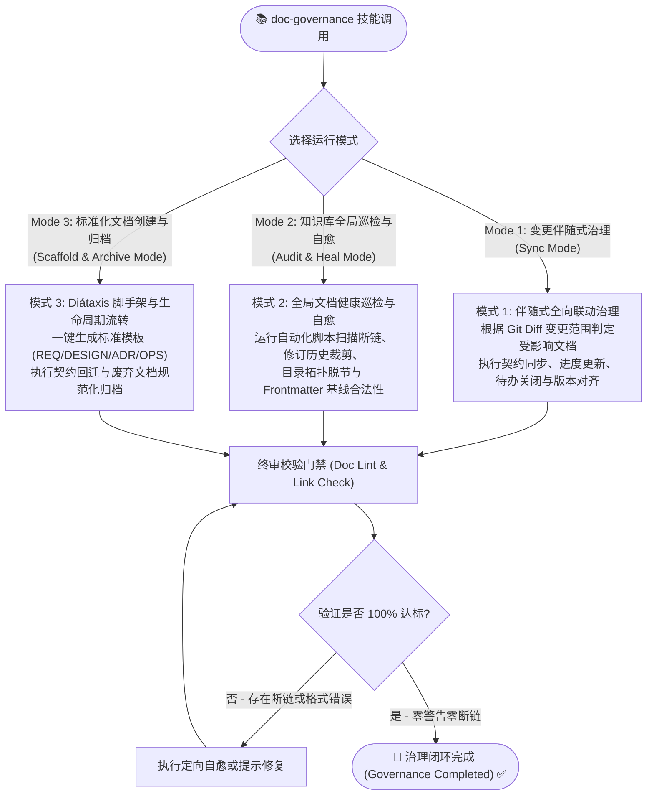
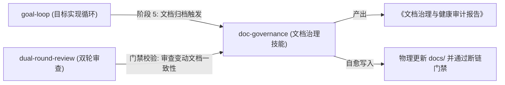

# `doc-governance` 文档工程与知识库治理技能架构设计书 (Architecture & Design Specification)

> **文档控制信息**
> - **文档标识**: SKILL-DES-DOC-GOVERNANCE-2026
> - **当前版本**: V1.0.0 (初版发布：融合现代软件工程与 AI 智能体时代的文档治理体系)
> - **设计所有者**: 王辉
> - **设计架构师**: Antigravity AI Agent
> - **创建日期**: 2026-09-10
> - **理论与实践源流**:
>   - **现代软件工程理论**: Daniele Procida 的 **Diátaxis 框架** (四象限系统化文档架构)
>   - **Docs-as-Code (DaC)**: Write the Docs 哲学 (文档即代码、版本化、CI/CD 自动化门禁)
>   - **架构决策记录**: **MADR 3.0 / Michael Nygard ADR** (不可逆决策审计与演进追踪)
>   - **AI 智能体时代规范**:
>     - **Dual-Audience 原则**: 人类可读性 (Human-Readable) 与智能体机器可读性 (Agent-Consumable) 统一
>     - **Manus AI / Ralph Loop**: 上下文防腐与物理持久化唯一真相源
>     - **Paperclip 逐行凭证**: Line-pinned Citations 与显式物理文件链接 (`[xxx.md](./path/xxx.md)`)
>     - **DeepResearcher 实战工程资产**: 经由 v0.1.0~v0.6.0 验证的 `DOCUMENTATION-GOVERNANCE.md`、`docs/index.md` 全局拓扑索引与全向联动维护规程

---

## 1. 背景与核心痛点 (Problem Statement)

在以大语言模型（LLM）为核心的 AI 智能体软件研发时代，传统的文档管理模式正在遭遇前所未有的范式危机。文档不再仅仅是给人类工程师偶尔查阅的参考书，更是**直接作为 AI 智能体生成代码、规划架构与执行 TDD 的核心上下文（Context Window）**。

在多次复杂项目实战中，暴露出以下四大系统性痛点：

### 1.1 文档与代码的严重漂移 (Doc Drift & Hallucination)
* **表象**：代码库已经过多次重构、API 字段重命名或业务规则调整，但设计文档和契约规格依然停留在历史版本；
* **致命危害**：后续接手的 AI 智能体基于陈旧文档作为 Context 编写代码，生成了已被弃用的废弃字段或调用了已删除的接口，导致单测大面积崩溃，产生灾难性的“文档引发代码幻觉（Doc-Induced Hallucinations）”。

### 1.2 巨石单体文档与长上下文反噬 (Context Rot in Monolithic Docs)
* **表象**：将几万字的需求、架构、接口、历史记录全部揉入一个或少数几个几千行的超大单体 Markdown 文件；
* **致命危害**：智能体在读取此类文档时，瞬间消耗 30k~50k 的 Context Token，引发“迷失在中间（Lost in the Middle）”现象与注意力衰减（Attention Dilution），更导致在局部修改文档时频繁发生行号失配、内容被截断与覆盖性破坏。

### 1.3 概念指代模糊与断链地狱 (Broken Links & Ambiguous Entities)
* **表象**：文档中使用纯文本概念名指代业务模块（如“详见用户管理文档”），或者重命名/移动文件后未同步更新外部引用；
* **致命危害**：人类与 AI 均无法一键点击溯源，形成“404 断链死胡同”；AI 智能体因无法定位物理文件而凭空臆测，破坏了工程的可维护性与审计性。

### 1.4 版本号失控与修订历史无限膨胀 (Unbounded Revision Inflation)
* **表象**：每次小修小补随意自增版本号，修订历史表格追加至数十上百行，导致文档头部严重喧宾夺主；
* **致命危害**：大量过期的历史流水账挤占了本应留给业务规则与接口契约的黄金注意力窗口。

### 1.5 治理规范“纸上谈兵”缺乏自动化工具闭环 (Lack of Enforceable Tooling)
* **表象**：虽然在工程规范（如 `AGENTS.md`）中写下了详尽的文档治理规则，但在日常快节奏编码中，全凭开发者或 Agent 自觉遵守；
* **致命危害**：一遇到紧急交付，文档往往被“暂时放过”，最终沦为没人敢动、没人维护的技术债垃圾场。

---

## 2. 理论源流与现代架构基石 (Theoretical Foundations)

`doc-governance` 技能将现代软件工程与 AI 智能体时代的前沿工程实践深度融合，确立四大理论支柱：

```
                        ┌─────────────────────────────────────┐
                        │   doc-governance 技能理论四大支柱   │
                        └──────────────────┬──────────────────┘
                                           │
         ┌──────────────────┬──────────────┴─────┬──────────────────┐
         ▼                  ▼                    ▼                  ▼
   【Diátaxis 架构】   【Docs-as-Code】   【ADR 演进治理】   【AI 双受众与上下文工程】
   - 4 象限分类        - 文档即代码       - 历史不可篡改     - Human + Agent 双受众
   - 职责绝不混杂      - CI 门禁/自动化   - 状态机演进       - 总纲-子册拓扑
   - 消除认知阻抗      - Lint 静态检测    - 记录"Why"抉择    - 变动影响矩阵联动
```

### 2.1 现代软件工程：Diátaxis 四象限架构
根据 Daniele Procida 提出的 Diátaxis 体系，技术文档必须严格基于“用户的意图与心智模式”划分为四个正交象限，**严禁在同一份文档中混杂不同象限的内容**：

| 象限 | 导向目标 | 用户心智 | 本项目工程落地映射 |
|:---|:---|:---|:---|
| **Tutorials (教程)** | 学习导向 (Learning-oriented) | 新手入门，需要循序渐进的引导 | 新用户 Onboarding 指南、快速上手教程 |
| **How-To Guides (操作指南)** | 解决问题导向 (Problem-oriented) | 目标明确，需要快速达成具体操作 | 部署运维手册、测试执行指南、故障排查 SOP |
| **Technical Reference (参考规格)** | 信息/事实导向 (Information-oriented) | 严谨客观，查询权威机器事实 | API 契约、数据模型 Schema、Token 规范、配置清单 |
| **Explanation (深度解释)** | 理解与洞察导向 (Understanding-oriented) | 宏观探究，理解架构原理与取舍 | 架构设计总纲、选型评估对比、设计决策树 |

### 2.2 Docs-as-Code (DaC) 与自动化门禁
* **版本控制**：文档与代码位于同一仓库或受版本控制的公共技能库中，与代码修改同批次提交；
* **静态审查与测试 (Docs-as-Tests)**：引入自动化脚本对文档进行断链扫描、Frontmatter 完整性校验、修订历史行数检查；
* **不可逾越的交付门禁**：文档未同步或存在断链时，严格阻断合并流程。

### 2.3 ADR (Architecture Decision Records) 架构决策治理
* **记录“Why”而非仅“What”**：对于不可逆或高影响的架构变动，采用 MADR 3.0 标准模板记录背景、候选方案权衡（Pros/Cons）与最终决策理由；
* **Append-Only 追加式演进**：已接受（Accepted）的 ADR 绝不原地修改历史；若架构变化，通过创建新 ADR 并显式标记 `Supersedes ADR-xxx` 实现演进可追溯。

### 2.4 AI 智能体时代的文档革命：双受众与上下文防腐
* **Dual-Audience (双受众公理)**：
  - **人类友好**：清晰的层级、Mermaid 可视化拓扑、直观的表格排版；
  - **智能体友好 (Agent-Ready Context)**：严禁指代模糊，无歧义的语义字段、状态机全状态列举、反模式与负向规约（Negative Constraints）、显式物理文件链接 (`[xxx.md](./path/xxx.md)`)；
* **总纲-子册架构 (Hub-and-Spoke Topology)**：
  - **总纲 (Hub)**：描述宏观架构、限界上下文与路由分流，屏蔽底层代码细节，控制在 300 行以内；
  - **子册 (Spoke)**：承载微观垂直领域的精确实现契约与规则；
  - **收益**：智能体可按需加载子册，单次 token 消耗降低 70% 以上，彻底杜绝 Context Rot；
* **变动影响矩阵与全向联动 (Change Impact Matrix)**：
  - 构建代码变动与文档集合的映射函数：$f(\Delta \text{Code}) \to \{\text{Docs to Sync}\}$，杜绝只改代码不改文档。

---

## 3. `doc-governance` 技能定位与核心拓扑 (Skill Architecture)

`doc-governance` 定位为**全生命周期通用文档工程与知识库治理技能**。
它既能作为独立技能由用户或开发者按需调用，也能作为专用子模块由 `goal-loop` 的阶段 5（文档全向归档）直接激活。

### 3.1 三大核心运行模式 (Operational Modes)



---

## 4. 核心治理规范与执行基线 (Core Governance Standards)

### 4.1 目录分层与 Diátaxis 拓扑标准
知识库根目录推荐遵循清晰的关注点分离（SoC）拓扑：

```text
docs/
├── index.md                      # 全局总索引与知识库拓扑图 (必须实时反映最新结构)
├── DOCUMENTATION-GOVERNANCE.md   # 项目文档治理总规程
├── requirements/                 # 【1. 功能规格层 - Diátaxis Reference】(What)
│   ├── overview/                 #    功能全景地图与版本范围基线
│   ├── business/                 #    平台级业务规则与权限/状态机定义
│   ├── agent/                    #    智能体功能规格与提示词资产
│   ├── frontend/                 #    前端页面路由、交互规范与视觉设计规范
│   └── backend/                  #    后端 API 契约、统一错误信封与数据模型
├── design/                       # 【2. 架构设计层 - Diátaxis Explanation】(How)
│   ├── architecture/             #    系统总体代码架构总纲及分册子文档
│   └── adr/                      #    MADR 3.0 架构决策记录 (Append-Only)
├── planning/                     # 【3. 规划与评估层 - Diátaxis Explanation/Ref】(Which)
│   ├── 版本进度跟踪.md             #    按范围基线记录每个版本落地成果
│   ├── 后续优化方向汇总.md          #    统一待办清单 (Backlog 与已关闭清单)
│   └── *进度跟踪.md               #    各领域细分落地现状
├── operations/                   # 【4. 运维与指南层 - Diátaxis How-To / Tutorial】
│   ├── deployment.md             #    部署与环境配置手册
│   └── 试用指南.md                #    面向最终用户的操作手册
├── references/                   # 【5. 外部知识参考库】
└── archived/                     # 【6. 冻结归档文档】(仅保留高价值历史报告)
```

> **单一事实来源 (Single Source of Truth) 铁律**：
> 当多个文档涉及同一概念时，外部可见的行为与 API 契约以 `requirements/` 为唯一事实来源；`design/` 仅描述其内部实现架构，严禁在架构文档中另造一套 API 契约！

---

### 4.2 文档控制头与修订历史滑动窗口标准 (Frontmatter & Sliding Window)

所有纳入知识库管理的长期 Markdown 文档必须配置标准化头部：

```markdown
# [文档标题]

> **文档控制信息**
> - **文档标识**: [项目标识]-[领域码]-[简写]-[年份] (如: DR-REQ-AGENT-2026)
> - **当前版本**: V{major}.{minor}.{patch} (遵循语义化版本)
> - **文档状态**: [Draft | Active | Deprecated | Archived]
> - **机密等级**: [内部公开 | 敏感限制]
> - **生效日期**: YYYY-MM-DD
> - **文档所有者**: [负责人/角色]
> - **审核人**: [审核人/角色]

---

### 修订历史记录 (Revision History)

> 仅保留最近 5 条记录，更早历史可通过 `git log --oneline <file>` 查阅。

| 版本号 | 修订日期 | 修订人 | 审核人 | 修订描述 |
| :--- | :--- | :--- | :--- | :--- |
| **V1.2.0** | 2026-09-10 | AI Agent | 王辉 | 详细描述本次修改的核心架构点、对应提交 SHA 与闭环状态。 |
```

* **5 条滑动窗口硬门禁**：修订历史表格**最多保留最近 5 条记录**。新增记录时若总数超过 5 条，必须剔除最早记录，保持文档头部精悍聚焦；
* **语义化版本联动**：重大结构调整升 `major`，功能/规则增改升 `minor`，勘误与微调升 `patch`。

---

### 4.3 显式物理链接与断链零容忍 (Explicit Physical Links)
* **链接格式铁律**：文档间的交叉引用必须采用**带 `.md` 后缀的相对路径物理文件链接**：
  - ✅ 正确：`[视觉设计规范.md](./requirements/frontend/视觉设计规范.md)`
  - ❌ 错误：`[视觉设计规范](/requirements/frontend/视觉设计规范)` (缺失后缀，破坏本地 IDE 与无头环境解析)
  - ❌ 错误：`[视觉设计规范](file:///home/hui/...)` (硬编码绝对路径，破坏跨机器移植性)
* **全局索引同步**：任何新增、重命名、移动或归档文档的操作，**必须同步更新 `docs/index.md`**，并运行链接检测工具确保全局零断链（Exit Code 0）。

---

### 4.4 文档-代码全向联动维护规程 (Change Impact Matrix)

无论是代码演进还是需求规格调整，必须严格按照以下矩阵双向闭环：

| 代码或需求变更特征 | 必须同步更新的文档集合 | 验收与门禁标准 |
|:---|:---|:---|
| **新增/修改业务功能** | 1. `docs/planning/*进度跟踪.md`<br>2. `docs/planning/版本进度跟踪.md`<br>3. `docs/planning/后续优化方向汇总.md` (关闭对应待办) | 进度状态标记准确，关联合并 Commit SHA |
| **调整接口契约 / 数据模型** | 1. `docs/requirements/backend/后端功能设计文档.md` (API & 数据模型)<br>2. `docs/requirements/frontend/前端功能设计文档.md` (调用与类型) | 双方字段名、必填项与错误信封 100% 镜像对齐 |
| **页面路由 / UI 组件演进** | 1. `docs/requirements/frontend/前端功能设计文档.md` (路由表与流程)<br>2. `docs/requirements/frontend/视觉设计规范.md` (Token 与组件) | 交互流与 Token 命名一致，无虚构组件 |
| **底层核心架构 / 框架选型** | 1. `docs/design/architecture/*`<br>2. `docs/design/adr/*` (新增 MADR 记录)<br>3. `docs/planning/智能体框架选型评估.md` | 记录决策权衡、为什么否决其他备选方案 |
| **部署配置 / 环境变量变更** | 1. `docs/operations/deployment.md`<br>2. `docs/operations/试用指南.md` | 环境变量清单完整，启动命令可复现 |
| **文档拓扑变动 (新增/移动/删除)** | 1. `docs/index.md` (全局总索引)<br>2. 所有受影响的相对引用上游文件 | 执行链接审计工具，零 404 断链 |

---

## 5. 自动化工具链与自愈体系设计 (Tooling & Automation Suite)

为杜绝“仅有规范而无执行力”，`doc-governance` 技能将配套完备的自动化脚本套件（存放于 `skills/doc-governance/scripts/`）：

### 5.1 `check-doc-links.py`：全域断链与物理引用静态审计器
* **功能**：遍历文档目录，解析所有 `[text](path)` 相对链接；
* **校验点**：
  1. 目标文件物理是否存在；
  2. 是否遗漏了 `.md` 后缀；
  3. 锚点标题（`#heading`）是否存在于目标文件中；
* **门禁行为**：发现断链返回 Exit Code 1，列出具体文件、行号与失效目标。

### 5.2 `trim-revision.py`：修订历史滑动窗口自愈裁剪器
* **功能**：扫描所有文档头部的 `修订历史记录` 表格；
* **模式**：
  - `--dry-run`：仅分析哪些文件超过 5 条，给出警告；
  - `--fix --keep 5`：自动就地裁剪超额的历史行，保留最新的 5 条记录。

### 5.3 `audit-doc-health.py`：知识库全面健康度体检引擎
* **功能**：输出 Markdown 格式的《知识库综合健康体检报告》；
* **综合评分指标**：
  - 链接完整率 (Link Health: 100%)
  - 控制头合规率 (Frontmatter Compliance: 100%)
  - 修订历史合规率 (Revision Table Compliance: 100%)
  - 索引拓扑覆盖率 (Index Coverage: 100% 文件被收录)
  - 孤儿文档检测 (Orphan Docs: 存在未被任何文档引用的无主文件)

### 5.4 `scaffold-doc.sh`：Diátaxis 标准模板脚手架生成器
* **用法**：`bash skills/doc-governance/scripts/scaffold-doc.sh <type> <title> <category>`
* **支持类型**：`requirement`、`design`、`adr`、`how-to`、`progress-tracker`；
* **自动化行为**：自动计算标识码（如 `DR-REQ-xxx-2026`）、填充 V1.0.0 初始控制头、生成 1 行初始修订记录，并打印在 `docs/index.md` 中挂载的配置建议。

---

## 6. 与现有研发技能的协同契约 (Multi-Skill Synergy)



1. **与 `goal-loop` 协同契约**：
   - 在 `goal-loop` 阶段 5 执行时，主调度器调用 `doc-governance`，自动比对本轮 Git Commit 变更，推导出受影响的文档清单，引导智能体高效批次更新，完成后自动执行断链与修订历史裁剪，杜绝阶段 5 的手动摩擦。
2. **与 `dual-round-review` 协同契约**：
   - 在交付终审阶段，第二轮架构师可调用 `check-doc-links.py` 作为门禁验证凭据，凡存在文档断链或接口契约未同步者，直接定级为 P1 Blocker。

---

## 7. 详细落地实施规划 (Implementation Roadmap)

本技能的工程落地分为以下四个清晰阶段，每阶段遵循“红绿重构”与小步交付原则：

### 阶段 1: 架构设计方案编写与用户审批 (<当前阶段>)
* **交付物**: 本架构设计说明书 (`/home/hui/workspace/projects/cr-public-skills/docs/design/doc-governance-design.md`)；
* **验收标准**: 全面覆盖软件工程与 AI 智能体前沿实践，经由用户明确审批通过后方可开启下一阶段。

### 阶段 2: `doc-governance` 核心技能规程与参考库落地
* **目标目录**: `/home/hui/workspace/projects/cr-public-skills/skills/doc-governance/`
* **交付物**:
  - `SKILL.md` (主规程入口：定义适用场景、三种运行模式 SOP、反模式清单与门禁规则)；
  - `references/diataxis-taxonomy.md` (Diátaxis 分层与命名规范)；
  - `references/change-impact-matrix.md` (变动影响矩阵与全向联动细则)；
  - `references/adr-specification.md` (MADR 3.0 架构决策记录规范)；
  - `references/doc-audit-rubric.md` (文档健康审计评分量规)。

### 阶段 3: 自动化辅助脚本工具箱实现与验证
* **目标目录**: `/home/hui/workspace/projects/cr-public-skills/skills/doc-governance/scripts/`
* **交付物**:
  - `check-doc-links.py` (断链与锚点扫描)；
  - `trim-revision.py` (修订历史滑动窗口裁剪)；
  - `audit-doc-health.py` (全局健康审计器)；
  - `scaffold-doc.sh` (标准脚手架生成脚本)；
  - 编写脚本测试用例并验证 Exit Code 0。

### 阶段 4: 在 `DeepResearcher` 项目中实战集成与全量健康体检
* **验证动作**:
  - 在 `DeepResearcher` 中建立对公共技能 `doc-governance` 的软链接或调用入口；
  - 运行全局健康体检，出具一份实际的项目文档体检报告，完成首次闭环实战验证。
