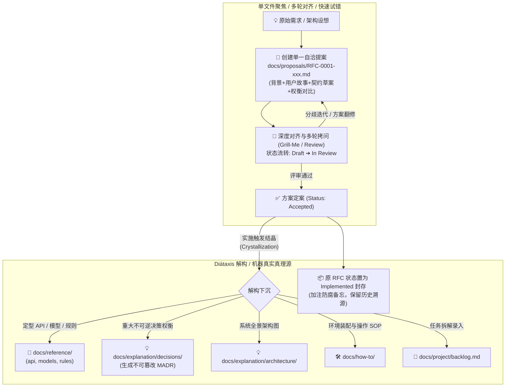
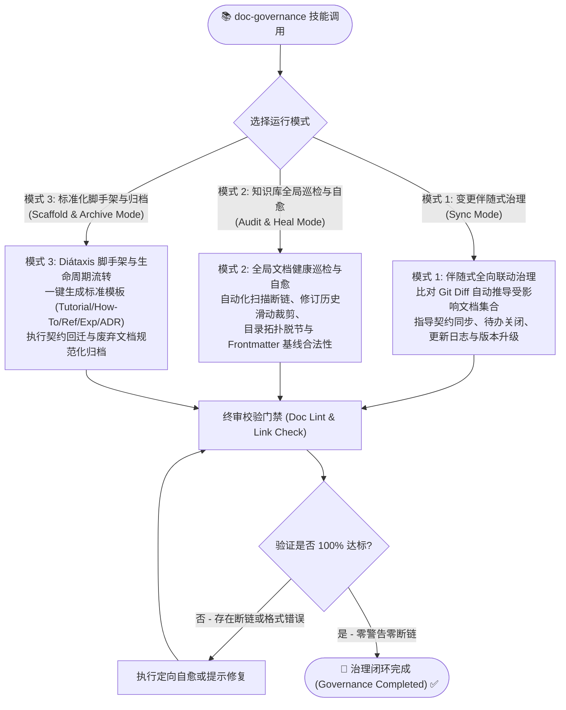

# `doc-governance` 文档工程与知识库治理技能架构设计书 (Architecture & Design Specification)

> **文档控制信息**
> - **文档标识**: SKILL-DES-DOC-GOVERNANCE-2026
> - **当前版本**: V1.2.0 (合入初期 RFC 提案孵化结晶流转规程、项目语言习惯与文件命名规范)
> - **设计所有者**: 王辉
> - **设计架构师**: Antigravity AI Agent
> - **创建日期**: 2026-09-10
> - **理论与实践源流**:
>   - **现代软件工程规范**: Daniele Procida 的 **Diátaxis 框架** (四象限系统化文档架构，Python/Canonical/Django/NumPy 官方标准)
>   - **Docs-as-Code (DaC)**: Write the Docs 哲学 (文档即代码、版本化、CI/CD 自动化门禁)
>   - **架构决策治理**: **MADR 3.0 / Michael Nygard ADR** (不可逆决策审计与演进追踪)
>   - **需求演进标准**: **RFC / KEP / PEP 提案模型** (初期单文件多轮对齐与定案结晶机制)
>   - **AI 智能体时代规范**:
>     - **Dual-Audience 原则**: 人类可读性 (Human-Readable) 与智能体机器可读性 (Agent-Consumable) 统一
>     - **Machine-Readable Index**: `llms.txt` + `index.md` 双重全局导航
>     - **Manus AI / Ralph Loop**: 上下文防腐与物理持久化唯一真相源
>     - **Paperclip 逐行凭证**: Line-pinned Citations 与显式物理文件链接 (`` `[xxx.md](./path/xxx.md)` ``)

---

## 1. 背景与核心痛点 (Problem Statement)

在以大语言模型（LLM）为核心的 AI 智能体软件研发时代，传统的文档管理模式正在遭遇前所未有的范式危机。文档不再仅仅是给人类工程师偶尔查阅的静态参考书，更是**直接作为 AI 智能体生成代码、规划架构与执行 TDD 的核心上下文（Context Window）**。

在多次复杂项目实战中，暴露出以下系统性痛点：

### 1.1 瀑布周期切分目录导致的“职责混杂与查找割裂” (Waterfall Lifecycle Anti-Pattern)
* **表象**：许多团队习惯按项目开发的阶段来组织目录（如 `requirements/`、`design/`、`planning/`、`operations/`）；
* **致命危害**：
  1. **内容属性严重混淆**：API 契约明明是权威技术参考（Reference），却被当作初期的“需求”塞在 `requirements/backend/`；架构设计（`design/`）与框架选型评估（`planning/`）明明都是系统原理解释（Explanation），却因为发生在不同阶段被物理隔绝；
  2. **违反 Diátaxis 核心铁律 (No Mixing)**：一份文档里既有“怎么部署（How-To）”，又有“API 字段（Reference）”，还充斥着“为什么要这样选型（Explanation）”。智能体为了查一个字段，被迫吃进整页背景说明，导致上下文预算急速枯竭并引发严重的“注意力稀释（Attention Dilution）”；
  3. **职责模糊引发多份事实**：开发者在设计阶段写一套 API 契约，在后端实现时又更新另一套，造成致命的数据模型分歧。

### 1.2 文档与代码的严重漂移 (Doc Drift & Hallucination)
* **表象**：代码库已经过多次重构、API 字段重命名或业务规则调整，但设计文档和契约规格依然停留在历史版本；
* **致命危害**：后续接手的 AI 智能体基于陈旧文档作为 Context 编写代码，生成了已被弃用的废弃字段或调用了已删除的接口，导致单测大面积崩溃，产生灾难性的“文档引发代码幻觉（Doc-Induced Hallucinations）”。

### 1.3 巨石单体文档与长上下文反噬 (Context Rot in Monolithic Docs)
* **表象**：将几万字的需求、架构、接口、历史记录全部揉入一个或少数几个几千行的超大单体 Markdown 文件；
* **致命危害**：智能体在读取此类文档时，瞬间消耗 30k~50k 的 Context Token，引发“迷失在中间（Lost in the Middle）”现象，更导致在局部修改文档时频繁发生行号失配、内容被截断与覆盖性破坏。

### 1.4 概念指代模糊与断链地狱 (Broken Links & Ambiguous Entities)
* **表象**：文档中使用纯文本概念名指代业务模块（如“详见用户管理文档”），或者重命名/移动文件后未同步更新外部引用；
* **致命危害**：人类与 AI 均无法一键点击溯源，形成“404 断链死胡同”；AI 智能体因无法定位物理文件而凭空臆测，破坏了工程的可维护性与审计性。

### 1.5 版本号失控与修订历史无限膨胀 (Unbounded Revision Inflation)
* **表象**：每次小修小补随意自增版本号，修订历史表格追加至数十上百行，导致文档头部严重喧宾夺主；
* **致命危害**：大量过期的历史流水账挤占了本应留给业务规则与接口契约的黄金注意力窗口。

---

## 2. 理论源流与现代架构基石 (Theoretical Foundations)

`doc-governance` 作为通用的公共技能，必须立足于**行业公认的最佳实践与 AI 时代的第一性原理**，拒绝为了兼容局部历史项目的旧习惯而削足适履。确立以下四大理论支柱：

```
                        ┌─────────────────────────────────────┐
                        │   doc-governance 技能理论四大支柱   │
                        └──────────────────┬──────────────────┘
                                           │
         ┌──────────────────┬──────────────┴─────┬──────────────────┐
         ▼                  ▼                    ▼                  ▼
   【Diátaxis 架构】   【Docs-as-Code】   【ADR 演进治理】   【AI 双受众与上下文工程】
   - 4 象限正交分类    - 文档即代码       - 历史不可篡改     - Human + Agent 双受众
   - 彻底消灭混杂      - CI 门禁/自动化   - 状态机演进       - 总纲-子册拓扑
   - 读者意图导向      - Lint 静态检测    - 记录"Why"抉择    - 变动影响矩阵联动
```

### 2.1 现代软件工程：Diátaxis 四象限架构体系
Diátaxis 是被 Python 官方文档、Canonical/Ubuntu、Django、NumPy 等顶级开源生态广泛采纳的权威架构。它根据**读者的即时意图（Intent）与心智状态**，将文档划分为四个互不重叠的正交维度：

| 象限维度 | 导向目标 | 读者心智 | 内容特征 | 典型文档形态 |
|:---|:---|:---|:---|:---|
| **1. Tutorials (教程)** | 学习导向 (Learning-oriented) | “带领我入门，给我一个成功体验” | 步骤化、循序渐进、目标是让新手建立信心，不掺杂高级理论 | 快速上手向导、5分钟创建第一个智能体工作流 |
| **2. How-To Guides (操作指南)** | 解决具体问题导向 (Problem-oriented) | “我有特定任务，告诉我如何做” | 目标明确、食谱式步骤（Recipes）、直接给出操作命令，无背景铺垫 | 生产部署指南、本地多容器搭建、故障排查 SOP |
| **3. Reference (技术参考)** | 事实与信息导向 (Information-oriented) | “查阅权威机械规格，确认事实” | 极度严谨、客观、描述技术实体本身（字段/类型/状态机/约束），不教学、不解释 | API 契约规格、数据模型 Schema、业务规则矩阵、Token 定义 |
| **4. Explanation (深度剖析)** | 理解与洞见导向 (Understanding-oriented) | “深入剖析原理，解释为什么这样设计” | 宏观全景、阐述设计背景、技术对比、架构决策推演，回答“Why” | 总体架构设计说明、技术选型备忘录、ADR 决策记录 |

> **Diátaxis 核心铁律 (Strict Separation Rule)**：
> **严禁在单份文档中混合不同象限的内容！**
> 如果在写 Reference（API 规格）时想解释为什么选这个算法，必须拆分为独立的 Explanation 文档并通过超链接引用；如果在写 How-To（部署步骤）时想阐述底层网络拓扑，必须链接到架构说明，绝不在操作指南中展开大篇幅理论。

### 2.2 Docs-as-Code (DaC) 与自动化门禁
* **同源版本化**：文档与源码同在一个 Git 仓库中，遵循 Pull Request、Code Review、Git Tag 发布流程；
* **Docs-as-Tests（文档即测试）**：将断链扫描、Frontmatter 合规性、修订历史滑动裁剪做成 CI 门禁（Exit Code 0 机制）；
* **不可逾越的阻断线**：接口改动未同步文档、或文档中存在 404 断链时，严格阻断代码合并。

### 2.3 MADR 3.0 / Nygard 架构决策治理 (ADR)
* **不可逆决策追溯**：对重大的技术选型、架构分层、数据流演进采用 MADR 3.0 标准模板记录背景与利弊权衡；
* **Append-Only（追加日志原则）**：已通过的 ADR 绝不原地篡改。若发生变更，通过新建 ADR 并显式声明 `Supersedes ADR-xxx`，确保系统演进脉络清晰可审计。

### 2.4 AI 智能体时代的文档革命：双受众与上下文防腐
* **Dual-Audience (双受众公理)**：
  - **人类工程师**：需要可视化 Mermaid 架构图、清晰的层级、良好的排版体验；
  - **AI 智能体 (Agent-Ready Context)**：需要精确的无歧义概念、显式物理文件链接 (`` `[xxx.md](./path/xxx.md)` ``)、严格的负向约束清单（Negative Invariants）、结构化表格；
* **Machine-Readable Index (`llms.txt` + `index.md`)**：
  - 既有给人类浏览的全局 Markdown 索引（`index.md`），又有给 LLM 爬取和加载全局知识拓扑的机器地图（`llms.txt`）；
* **总纲-子册架构 (Hub-and-Spoke Topology)**：
  - 总纲控制在 300 行以内，负责全景限界上下文与分流索引；底层细节完全下沉至子册，智能体按需调阅，降低 Token 消耗 70% 以上；
* **变动影响矩阵 (Change Impact Matrix)**：
  - 代码变动实时触发对应文档的联动更新，闭环杜绝“代码已变而文档脱节”。

---

## 3. 现代标准知识库目录拓扑 (Modern Standard Directory Topology)

基于 Diátaxis 四象限标准、ADR 演进治理与 AI 智能体机器可读性，`doc-governance` 技能确立如下**通用标准知识库目录拓扑**：

```text
docs/
├── index.md                 # 【全局人类总入口】全景知识库拓扑与分类索引
├── llms.txt                 # 【AI 智能体机器地图】精炼的机器可读知识拓扑与关键参考入口
├── GOVERNANCE.md            # 【知识库治理规程】文档分类、生命周期与 CI 门禁规则
│
├── proposals/               # 💡 0. 需求与设计孵化层 (Inception / RFC Proposals)
│   │                        # ⭐ 项目初期单文件聚焦对齐空间，定案后结晶下沉至 Diátaxis 稳态
│   ├── RFC-0001-xxx.md      # 初期对齐提案草案 (Draft -> In Review -> Accepted)
│   └── archive/             # 已结晶下沉的提案历史归档 (Implemented / Superseded)
│
├── tutorials/               # 🎓 1. 教程象限 (Learning-Oriented / Newcomer Success)
│   ├── quick-start.md       # 5 分钟上手开发与运行首个特性
│   └── onboarding.md        # 新成员/新智能体工作流与环境就绪向导
│
├── how-to/                  # 🛠️ 2. 操作指南象限 (Problem-Oriented / Task Recipes)
│   ├── deployment.md        # 生产环境容器化构建与服务发布 SOP
│   ├── local-setup.md       # 本地多服务联调与数据库初始装配
│   ├── testing-guide.md     # 单元/集成/E2E 测试套件执行与覆盖率校验
│   └── troubleshooting.md   # 隐蔽缺陷排查、异步死锁与框架踩坑手册 (SOP)
│
├── reference/               # 📖 3. 技术参考象限 (Information-Oriented / Machine Truth)
│   │                        # ⭐ AI 智能体生成代码的核心上下文真相源 (Single Source of Truth)!
│   ├── api/                 # 外部与内部 API 契约规格、统一错误信封、Endpoint 清单
│   ├── models/              # 领域数据模型、Schema 契约、数据库实体与 DTO 定义
│   ├── rules/               # 平台业务规则、状态机状态图、权限矩阵与智能体行为协议/提示词契约
│   └── ui/                  # 前端设计 Token、UI 基础组件规范、交互事件契约
│
├── explanation/             # 💡 4. 深度剖析象限 (Understanding-Oriented / The "Why")
│   ├── architecture/        # 系统总体代码架构总纲 (Hub) 与各子系统深度剖析 (Spokes)
│   ├── decisions/           # ADR 架构决策记录 (MADR 3.0 格式, 0001-xxx.md, Append-Only)
│   ├── analysis/            # 技术调研备忘录、第三方框架选型评估、可行性分析报告
│   └── concepts/            # 核心业务领域深层概念、设计哲学与数学/算法模型阐释
│
└── project/                 # 🚀 5. 工程演进与项目管理 (Project Management & Evolution)
    ├── roadmap.md           # 产品规划路线图与版本里程碑矩阵
    ├── changelog.md         # 版本发布日志与交付物归档
    └── backlog.md           # 统一待办事项、后续优化方向汇总与已关闭清单
```

### 目录分层职责与单一事实来源对比表

| 目录层级 | Diátaxis 定位 | 唯一事实来源 (Single Source of Truth) | 严禁承载内容 |
|:---|:---|:---|:---|
| `proposals/` | Inception / Proposals | **项目初期与重大特性需求、设计草案、权衡对齐的临时单文件孵化空间** | 长期已生效的运行态基线（定案后必须结晶下沉至 Diátaxis） |
| `tutorials/` | Tutorials | 新手入门第一步体验 | 详细 API 错误码、深层架构选型争论 |
| `how-to/` | How-To Guides | 具体的任务解决步骤（操作 SOP） | 领域理论长篇论述、接口数据模型声明 |
| `reference/` | Technical Reference | **所有对外接口、数据模型、业务状态机与安全规则的唯一真相源** | 操作教程、方案背景为什么这么选的辩论 |
| `explanation/` | Explanation | **系统架构设计总纲、ADR 决策演进记录与选型理由的唯一真相源** | 具体 API 字段定义、临时任务排期 |
| `project/` | Project Governance | **版本发布日志、发版历史与待办 Backlog 的唯一真相源** | 架构实现细节、操作指南 |

---

## 4. 核心治理规范与执行基线 (Core Governance Standards)

### 4.1 文档控制头与修订历史滑动窗口标准 (Frontmatter & Sliding Window)

所有纳入知识库管理的长期 Markdown 文档必须配置标准化头部：

```markdown
# [文档标题]

> **文档控制信息**
> - **文档标识**: [项目标识]-[分类码]-[简写]-[年份] (如: CR-REF-API-2026, CR-EXP-ARCH-2026)
> - **当前版本**: V{major}.{minor}.{patch} (严格遵循语义化版本)
> - **文档状态**: [Draft | Active | Deprecated | Superseded]
> - **机密等级**: [内部公开 | 敏感限制]
> - **生效日期**: YYYY-MM-DD
> - **文档所有者**: [负责人/角色]
> - **审核人**: [审核人/角色]

---

### 修订历史记录 (Revision History)

> 仅保留最近 5 条记录，更早历史可通过 `git log --oneline <file>` 查阅。

| 版本号 | 修订日期 | 修订人 | 审核人 | 修订描述 |
| :--- | :--- | :--- | :--- | :--- |
| **V1.2.0** | 2026-09-10 | AI Agent | 王辉 | 详细描述本次修改的核心架构点、对应提交 SHA 与闭环状态。 |
```

* **5 条滑动窗口硬门禁**：修订历史表格**最多保留最近 5 条记录**。新增记录时若总数超过 5 条，必须剔除最早记录，保持文档头部精悍聚焦；
* **语义化版本联动**：重大结构/破坏性变动升 `major`，功能/规则增改升 `minor`，勘误与微调升 `patch`。

---

### 4.2 显式物理文件链接与断链零容忍 (Explicit Physical Links)
* **链接格式铁律**：文档间的交叉引用必须采用**带 `.md` 后缀的相对路径物理文件链接**：
  - ✅ 正确：`` `[视觉设计规范.md](../reference/ui/视觉设计规范.md)` ``
  - ❌ 错误：`` `[视觉设计规范](/reference/ui/视觉设计规范)` `` (缺失后缀，破坏本地 IDE 与无头环境解析)
  - ❌ 错误：`` `[视觉设计规范](file:///home/hui/...)` `` (硬编码绝对路径，破坏跨机器移植性)
* **全局索引同步**：任何新增、重命名、移动或归档文档的操作，**必须同步更新 `docs/index.md` 与 `docs/llms.txt`**，并运行链接检测工具确保全局零断链（Exit Code 0）。

---

### 4.3 文档-代码全向联动维护规程 (Change Impact Matrix)

无论是代码演进还是需求契约调整，必须严格按照以下矩阵双向闭环：

| 代码或功能变更特征 | 必须同步更新的文档集合 | 验收与门禁标准 |
|:---|:---|:---|
| **新增/修改业务功能** | 1. `docs/reference/rules/` (规则)<br>2. `docs/project/changelog.md` (发布日志)<br>3. `docs/project/backlog.md` (关闭对应待办) | 进度状态标记准确，关联合并 Commit SHA |
| **调整接口契约 / 数据模型** | 1. `docs/reference/api/` (API 规格)<br>2. `docs/reference/models/` (数据模型与 Schema) | 字段名、类型、必填项与错误信封 100% 镜像对齐 |
| **前端页面 / UI 组件演进** | 1. `docs/reference/ui/` (Token 与组件契约)<br>2. `docs/how-to/` (若涉及新页面操作指引) | 交互流与 Token 命名一致，无虚构组件 |
| **底层核心架构 / 框架选型** | 1. `docs/explanation/architecture/` (架构总纲与子册)<br>2. `docs/explanation/decisions/` (新建 MADR 记录)<br>3. `docs/explanation/analysis/` (选型评估) | 记录决策权衡、为什么否决其他备选方案 |
| **部署配置 / 环境脚本变更** | 1. `docs/how-to/deployment.md`<br>2. `docs/how-to/local-setup.md` | 环境变量清单完整，启动命令可复现 |
| **文档拓扑变动 (新增/移动/删除)** | 1. `docs/index.md` (总索引)<br>2. `docs/llms.txt` (机器地图)<br>3. 所有受影响的相对引用上游文件 | 执行链接审计工具，零 404 断链 |

---

### 4.4 初期探索向稳态演进：RFC 提案孵化与 Diátaxis 结晶流转规程 (Proposal-to-Crystallization Lifecycle Protocol)

在项目初期（0-to-1 阶段）或重大特性立项探索期，需求具有高变动性，方案需经历多次反复对齐、争辩与设计推演。若在此阶段过早将未成熟设想生硬打散进 Diátaxis 各象限，不仅会导致极高的多文件对齐认知摩擦，更会严重污染 `reference/` 这一神圣的“当前机器权威真理源”。

为此，`doc-governance` 确立**“两阶段生命周期演进模型 (Two-Phase Evolution Model)”**：



#### 1. 提案孵化规范 (RFC Proposal Standards)
* **单文件自洽 (Self-Contained Unit)**：每个新功能或重大改动在 `docs/proposals/` 下创建单一文档（如 `RFC-0001-canvas-collab.md`），集中呈现背景、场景、契约草案、选型对比与未决问题列表；
* **状态机流转控制**：提案头部 Frontmatter 必须标明状态：`Draft`（草拟） ➔ `In Review`（多轮对齐中） ➔ `Accepted`（定案批准） / `Rejected`（被否决）；
* **对齐高内聚**：人类与 AI 针对该单一文件进行高效的批注、修改或使用 `/grill-me` 深度盘问，所有探讨在此闭环，绝不污染 `reference/`。

#### 2. 定案结晶下沉 SOP (Crystallization SOP)
当提案被正式批准（状态变更为 `Accepted`）并进入代码开发阶段时，严格执行**结晶解构**：
1. **实体契约下沉**：将已定型的 API、Schema、错误信封提取至 `docs/reference/api/` 与 `docs/reference/models/`；
2. **业务规则下沉**：将状态机流转与权限策略提取至 `docs/reference/rules/`；
3. **决策证据沉淀**：将方案备选权衡与否决原因提炼为 MADR 记录存入 `docs/explanation/decisions/`；
4. **宏观架构下沉**：将全景流程与分层拓扑更新至 `docs/explanation/architecture/`；
5. **历史提案封存防腐**：将原 RFC 状态更新为 `Implemented`，并在文档头部显式声明防腐警示：
   > ⚠️ **历史溯源备忘**：本提案已于 YYYY-MM-DD 定案结晶。当前系统权威接口与模型以 `` `[reference/...](...)` `` 为准，本文件仅作为立项决策历史溯源，不再增量维护。

---

### 4.5 项目语言习惯与文件命名规范 (Language Habit & Naming Standards)

为了保证跨团队、跨项目、跨人机协作的认知连贯性，`doc-governance` 确立如下语言与命名基线：

#### 1. 语言习惯继承铁律 (Language Continuity Rule)
* **尊重既有工程语言基线**：
  - 若目标工程既有文档以**中文**为主（如本工程及多数国内研发生态），后续所有新增、演进与修订的文档**强制统一使用中文**编写标题、正文与架构说明，严禁无故引入中英文混杂割裂；
  - 若目标工程既有文档为**纯英文**，则后续文档继续严格保持英文。
* **概念与术语正交分离**：
  - 文档叙述、业务背景、操作指引使用项目主语言（如中文）；
  - 计算机科学标准标识符、API Endpoint、JSON 字段名、Git Commit 规范前缀（`feat`, `fix`, `docs` 等）遵循行业通用英文，严禁生硬翻译或音译破坏代码可读性。

#### 2. 文件命名规范 (File Naming Conventions)
* **项目初期 (0-to-1 Inception Phase)**：
  - 文件命名优先推荐使用**全小写中划线 (kebab-case)** 英文命名风格（如 `quick-start.md`, `canvas-collab.md`, `rfc-0001-multi-agent.md`），以保障在不同操作系统（Linux、macOS、Windows 大小写敏感度差异）、Git 索引以及 Web URL 路由解析中的最高兼容性与零歧义；
* **既有项目与用户偏好确认 (Respect Existing & Inquire on Ambiguity)**：
  - 若工程已有成体系的中文文件命名习惯（如 `前端功能设计文档.md`、`视觉设计规范.md`），智能体必须**优先尊重既有命名体系**，严禁擅自对既有稳定文件进行重命名；
  - 在初期立项或面临中英文命名歧义时，智能体应**主动向用户询问确认**，将文件命名倾向的最终裁决权交予人类架构师。

---

## 5. `doc-governance` 技能定位与核心运行模式 (Skill Architecture)

技能物理定位为公共技能：`/home/hui/workspace/projects/cr-public-skills/skills/doc-governance/`。

### 5.1 三大运行模式



---

## 6. 自动化工具箱与脚本体系设计 (Tooling & Automation Suite)

存放于 `skills/doc-governance/scripts/`：

| 脚本工具 | 核心功能 | 自动化与自愈行为 |
|:---|:---|:---|
| **`check-doc-links.py`** | 全域物理链接与锚点断链静态扫描器 | 递归扫描所有 Markdown 相对链接，校验目标文件物理存在、校验 `.md` 后缀、校验 `#anchor` 标题有效性。有断链 Exit Code 1 阻断。 |
| **`trim-revision.py`** | 修订历史滑动窗口自愈裁剪器 | 检查修订表格行数，`--fix --keep 5` 自动就地裁剪超额历史行，保持头部精悍。 |
| **`audit-doc-health.py`** | 知识库全面健康度体检引擎 | 综合计算链接完整率、基线合规率、修订合规率、Diátaxis 拓扑覆盖率，检测孤儿文档并出具健康诊断报告。 |
| **`generate-llms-txt.py`** | 机器可读 `llms.txt` 自动化生成器 | 基于知识库拓扑与各文件 Frontmatter 摘要，自动生成紧凑的 `docs/llms.txt`，赋能 AI 智能体秒级掌握全局知识。 |
| **`scaffold-doc.sh`** | Diátaxis & RFC 标准脚手架生成脚本 | 快速生成符合教程、指南、参考规格、深度解释、ADR 或初期 RFC 提案的标准文件模板（支持按项目语言与命名规则参数初始化）。 |

---

## 7. 既有项目平滑迁移机制 (Legacy Migration Protocol)

针对像 `DeepResearcher` 这样已存在历史目录结构（requirements, design, planning, operations）的项目，`doc-governance` 技能提供明确的**渐进式映射与迁移路径**，杜绝硬推倒破坏既有索引：

```text
【既有老目录】                     【Diátaxis 现代标准目录】
requirements/agent/         ───►  reference/rules/ (智能体行为协议与规约)
requirements/backend/       ───►  reference/api/ + reference/models/ (API与数据模型)
requirements/frontend/      ───►  reference/ui/ (设计Token与组件规范)
requirements/business/      ───►  reference/rules/ (业务规则与状态机)
design/architecture/        ───►  explanation/architecture/ (系统架构剖析)
planning/*选型评估.md        ───►  explanation/analysis/ (选型与可行性分析)
operations/deployment.md    ───►  how-to/deployment.md (部署指南)
operations/试用指南.md       ───►  tutorials/onboarding.md (新手试用教程)
planning/版本进度跟踪.md      ───►  project/changelog.md (发版历史)
planning/后续优化方向汇总.md   ───►  project/backlog.md (待办与优化清单)
```

* 技能脚本自带 `--compat` 兼容探测能力，支持在老结构项目上平稳运行健康检查，同时提供一键迁移映射规划。

---

## 8. 实施计划与交付里程碑 (Implementation Roadmap)

- [x] **阶段 1：现代架构设计方案编写与用户审批 (<已由王辉正式审批定案>)**
  - 产出物：`/home/hui/workspace/projects/cr-public-skills/docs/explanation/architecture/doc-governance-design.md` (V1.2.0)
- [x] **阶段 2：`doc-governance` 核心技能规程与参考库落地 (<已交付并入库: cd4731b>)**
  - 目标目录：`/home/hui/workspace/projects/cr-public-skills/skills/doc-governance/`
  - 交付物：
    - `SKILL.md` (主规程：适用场景、三种运行模式 SOP、反模式清单与硬门禁)
    - `references/diataxis-standard.md` (Diátaxis 详细分层与写作边界标准)
    - `references/rfc-crystallization-lifecycle.md` (初期 RFC 提案与结晶下沉生命周期规程)
    - `references/language-naming-conventions.md` (项目语言习惯与文件命名规范)
    - `references/change-impact-matrix.md` (代码-文档全向联动触发矩阵)
    - `references/adr-specification.md` (MADR 3.0 决策规范与生命周期)
    - `references/legacy-migration-guide.md` (既有老项目平滑迁移映射操作手册)
- [x] **阶段 3：自动化辅助脚本工具箱实现与自测 (<已交付并100%单测通过>)**
  - 目标目录：`/home/hui/workspace/projects/cr-public-skills/skills/doc-governance/scripts/`
  - 交付物：`check-doc-links.py`、`trim-revision.py`、`audit-doc-health.py`、`generate-llms-txt.py`、`scaffold-doc.sh`，配套单元测试 `test_doc_governance_scripts.py` 11/11 全绿通过。
- [x] **阶段 4：实战集成与全量体检验证 (<已完成: audit-doc-health 100/100 满分通过>)**
  - 在项目中挂载技能，执行首轮全域健康体检并出具诊断报告，链接零断链，生成全局索引 `index.md` 与机器地图 `llms.txt`。
