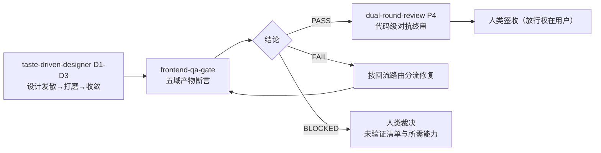

# `frontend-qa-gate` 前端产物验收技能架构设计书 (Architecture & Design Specification)

> **文档控制信息**
> - **文档标识**: SKILL-QA-FRONTEND-GATE-2026
> - **当前版本**: V1.0.0
> - **文档所有者**: 核心架构组
> - **生效日期**: 2026-09-21
> - **理论基准**: [《前端开发转向 AI Coding 的常见问题全景：研究证据、风险分层与验收清单》](../../reference/articles/ai-coding-frontend-common-problems.md)（kejun，2026-09-20 修订版）
> - **变更说明**: 首版。以该文献的六类风险清单与「风险分层」「十条可执行防御清单」为需求源，补齐「设计收敛」与「代码审查」之间的产物级验收空白。

---

## 1. 背景与目标 (Problem & Goals)

AI 生成前端代码的速度不断提升，但文章给出的证据链指出：**生成快不等于交付可用**。三条最相关的证据：

1. **设计说明与实际实现存在落差**（Design Theater 研究）：平均超过 25% 的面向用户设计说明未在界面中落实，功能性要求未落实比例为 34%；
2. **公开 AI 生成前端项目中存在结构性缺陷**（165 个仓库筛出 123 个可分析项目）：按其确定性规则 74% 存在被判为阻止发布的严重错误、52% 严重无障碍错误、49% 表单输入缺少标签、19% 图标按钮缺少可访问名称；
3. **异常处理与验证成本被独立观测**：CodeRabbit 样本中 AI 协作 PR 的错误处理与异常路径缺失接近人工 PR 的 2 倍；Sonar 调查中 48% 开发者总会在提交前验证 AI 代码、38% 认为审查 AI 代码比审查同事代码更费力。

仓库既有的两个质量技能各自解决了问题的一半：

| 技能 | 回答的问题 | 缺口 |
|---|---|---|
| `taste-driven-designer` | 设计是否有品味、方向是否正确 | 不覆盖运行时可验证性（响应式、状态、无障碍、浏览器、性能） |
| `dual-round-review` | 代码是否正确（静态推理 + 条件运行时维度） | 判据是 diff 与代码推理，不产出真实浏览器行为证据 |

**目标**：新建第三块拼图——只做**产物级断言**的验收技能，并保持三者边界清晰、互不替代。

---

## 2. 理论支柱 (Theoretical Pillars)

| 支柱 | 来源 | 对应机制 |
|---|---|---|
| **产物级验收优先于叙述** | 文献 A7「完成报告失真」与防御清单第 1、3 条 | 铁律 1 证据优先 + 证据三态（已实现 / 已运行验证 / 未验证） |
| **风险分层决定验收优先级** | 文献「风险分层」表（发布阻断 / 核心流程必须通过 / 质量预算 / 持续监测） | 五域断言 + 结论语义 PASS / FAIL / BLOCKED |
| **把约束变成可执行规则** | 文献防御清单第 7 条 | 报告结构机械门禁 + 可二值判定的断言清单；安全类显式交给宿主 CI |
| **工具分数不等于验收** | 文献 A6「自动化工具不能覆盖全部可用性问题」 | 无障碍自动扫描不构成结论，必须叠加键盘/焦点/读屏实测 |
| **相对判据优于绝对评分** | `taste-driven-designer` V1.1 反证（E1/E2/E3） | 本技能不输出任何分数/等级/通过率，结论只有三态 |
| **对抗式审查需要独立证据面** | `dual-round-review` 的事件边界 | 本技能为代码级终审提供运行时证据，而非重复其推理 |

---

## 3. 流程拓扑 (Process Topology)

**阶段门禁**：

- 入口：存在可访问的前端产物（URL / 构建产物）与明确的基线；
- 出口：五域断言全部记录、报告结构校验通过、结论明确（PASS / FAIL / BLOCKED）、缺陷已路由并落盘；
- **不存在降级通过路径**：宿主能力缺失时只能输出「未验证 + BLOCKED」。

---

## 4. 五域断言设计 (Five Assertion Domains)

| 域 | 条目数 | 判据要点 |
|:---:|:---:|---|
| D-S 交互状态 | 9 | 九态矩阵逐格填写（缺失态写「未实现」，不得留空） |
| D-R 响应式视口 | 8 | 内容连续适配（最小宽度 / 长文本 / 软键盘 / 安全区 / 横竖屏 / 触控 / 缩放），非断点数量 |
| D-A 无障碍 | 8 | 自动扫描 + 人工实测（键盘完成、焦点顺序与可见、读屏关键流程、减少动效） |
| D-B 浏览器覆盖 | 3 | 最低支持版本记录在案并在其上验证关键流程 |
| D-P 性能预算 | 3 | 构建体积与关键交互相对基线未回归 |

**契约**：每条断言必须二值可判定（PASS / FAIL）并附**操作步骤 + 证据引用 + 三态 + 环境**四要素（见 `references/browser-verification-protocol.md` §2）。

---

## 5. 证据契约与作废机制 (Evidence & Invalidation)

- **反伪造要求**：证据必须由本轮操作产生；报告记录轮次 nonce 与产物构建号/commit；空白或未加载截图不得作为通过证据；
- **作废规则**：回执缺失或不匹配、空白产物、构建号与证据不符、操作步骤不可复现 → 该轮作废，不入有效轮次；
- **作废二级上限**：连续 2 轮作废 → 停止并升级人工（产物管线故障信号）；
- 该机制与 `taste-driven-designer` 的 Critic 回执机制同构，但**对象不同**：前者校验产物证据链，后者校验品味评审输入。

---

## 6. 角色与边界模型 (Roles & Boundaries)

| 角色 | 承担者 | 职责 |
|---|---|---|
| 验收执行者 | 主智能体（含子智能体派发） | 执行断言、采集证据、按路由分流缺陷 |
| 证据独立复核者 | 可选独立子智能体 | 复核产物证据真实性（回执 + 构建号 + 证据文件） |
| 放行决策者 | **人类（用户）** | 签收；本技能不签发设计放行 |
| 代码级裁决者 | `dual-round-review` | 根因类缺陷的终审 |
| 品味与方向裁决者 | `taste-driven-designer` Critic + 人类创意总监 | 视觉品味与方向判断 |

---

## 7. 与既有技能的接口 (Interfaces)

### 7.1 与 `taste-driven-designer`
- 顺序：taste D1-D3 → 本技能 → `dual-round-review`；
- taste 的 **Gate A 是验收基线的单一来源（SSOT）**，本技能 `acceptance-matrix.md` 为**内联最小可执行副本**并标注来源（A 方案），不做跨技能硬链接以保证独立分发；
- taste 的 **D2 内嵌便宜自检**（轮内分钟级抽查）与本技能的完整验收分层：便宜检查高频、昂贵检查收尾；
- 边界：本技能不替代 Gate C 人类签收，不参与 Gate B 盲比（盲比是相对比较，本技能是二值断言）。

### 7.2 与 `dual-round-review`
- 代码级判据（hydration 静态推理、类型逃逸、依赖边界、竞态实现、资源泄漏）归其审查维度与失败模式库；
- 本技能引用其失败模式库**只引用编号与名称**（如模式 11 运行时环境与 SSR 沙盒盲区、模式 3 隐蔽异步竞态、模式 5 资源与上下文泄漏），不复制正文；
- 根因类缺陷转出时提供最小上下文：现象与复现步骤、断言 ID 与证据路径、怀疑范围、已排除假设。

### 7.3 与 `goal-loop`
- 挂载点：P3.5 集成验证（前端产物交付时的条件步骤）；
- 设计任务链路：taste D1-D3 → 本技能 → P4 双轮终审；非设计任务链路：本技能 → P4；
- 结论为 FAIL / BLOCKED 时不得声称前端验收通过。

---

## 8. 质量指标与测试策略 (Quality Metrics & Test Strategy)

| 层次 | 指标/门禁 |
|---|---|
| L0 静态 | `bash -n` 脚本语法、`git diff --check` 零空白残留、技能内相对链接可达 |
| L1 契约 | 17 个用例：边界扫描（无分数判据 / 人工签收 / 不侵入代码审查）、五域锚点、回流路由四类、命令顺序、跨技能硬链接禁令、报告校验脚本六种行为（含围栏剥离与计数一致性） |
| L2 集成 | 全仓 `pytest skills/ -q` 零回归（88 passed：seed 13 + taste 契约 11 + qa-gate 17 + 其他既有技能） |
| L-Doc 治理 | `check-doc-links.py` 断链 0、`audit-doc-health.py` 健康度 PASS、`llms.txt` 再生成一致 |
| 方法论保真 | 文献六类风险与「风险分层」「十条防御清单」的映射逐条可寻址（§1、§2、§4 与 `references/acceptance-matrix.md` §6） |

---

## 9. 边界与不承诺 (Boundaries & Non-Goals)

- 不实现浏览器驱动 / axe / Lighthouse / 性能测量的宿主绑定代码，只提供协议、门控与清单；
- 不覆盖代码级审查（归 `dual-round-review`）；不覆盖品味与方向裁决（归 `taste-driven-designer`）；
- 不覆盖安全与供应链（XSS / 密钥 / 依赖投毒）——属宿主 CI 与权限层，技能只负责记录与升级；
- 不承诺「跑完本技能即无缺陷」：断言清单是验收框架，不是缺陷率的保证；
- 不输出任何绝对分数、等级或通过率。

### 9.1 与文献原意的显式偏离 (Registered Deviations)

| # | 文献原意 | 本技能的处置 | 依据 |
|:---:|---|---|---|
| D1 | 文献逐项列出风险条目，未规定责任归属 | 按「可机器判定 → CI；产物行为 → 技能；代码推理 → 代码级审查」三分法显式划界，安全类明确移出技能范围 | 文献防御清单第 7 条「把约束变成可执行规则；能够自动判断的事项进入 CI」；技能文档无法提供扫描与权限的强制力 |
| D2 | 文献建议「自动扫描结合键盘与读屏检查」但未定义门禁 | 本技能把「自动扫描不得作为结论」写成铁律，并把读屏实测列为独立断言（能力缺失即 BLOCKED） | 文献 A6 明确「自动化工具不能覆盖全部可用性问题，也不能仅凭工具分数宣布验收完成」 |
| D3 | 文献主张按风险调整验收深度，未给出评分机制 | 本技能拒绝任何分数/通过率，只用 PASS / FAIL / BLOCKED 三态 + 证据三态 | `taste-driven-designer` V1.1 实跑反证：绝对分数区间压缩、与改动无相关、无鉴别力 |
