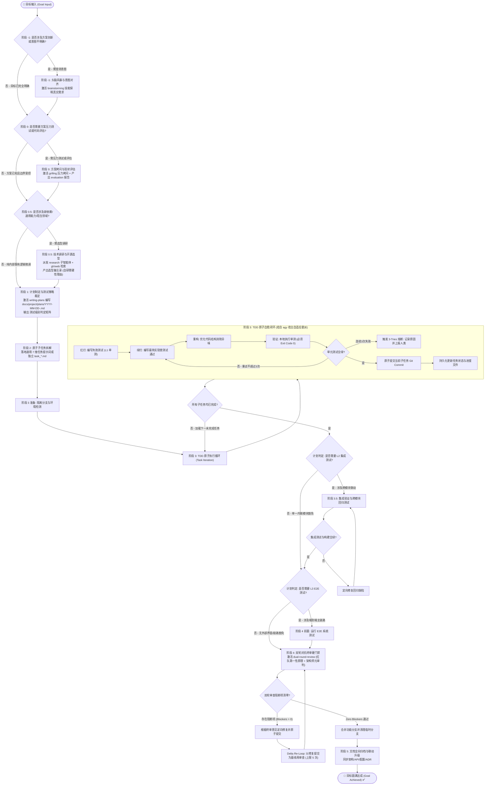

# `goal-loop` 目标实现循环技能架构设计书 (Architecture & Design Specification)

> **文档控制信息**
> - **文档标识**: SKILL-DES-GOAL-LOOP-2026
> - **当前版本**: V2.0.0 (宿主无关适配器 + 计划文件唯一真相源)
> - **设计所有者**: 王辉
> - **设计架构师**: Antigravity AI Agent
> - **创建日期**: 2026-09-08
> - **参考基准**:
>   - `/home/hui/workspace/projects/faceFusionCpp/docs/dev/zh/process/workflow.md` (工业级 TDD 与阶段流转规程)
>   - Manus AI Context Engineering (上下文工程与 2-Action Rule)
>   - Ralph Loop (Ralph Wiggum 磁盘持久化自主闭环理念)
>   - Claude Code `/goal` (自治目标收敛范式)
>   - 内部技能生态：`brainstorming`、`grilling`、`research` (`find-docs` / `gh` CLI)、`writing-plans`、`agy-delegation-workflow`、`dual-round-review`

---

## 1. 背景与核心痛点 (Problem Statement)

在大语言模型（LLM）驱动的软件研发自动化进程中，单轮对话或无状态的多轮交互在应对跨模块、多阶段的长任务（Long-Horizon Tasks）时暴露出以下系统性缺陷：

1. **上下文腐化与注意力衰减 (Context Rot)**：
   长任务在单会话中连续执行数十步后，上下文窗口被海量的历史输出、工具调用和调试日志填满。模型推理质量断崖式下降，出现“遗忘最初目标”、“产生逻辑幻觉”以及“注意力涣散”。
2. **需求理解偏差与盲目编码 (Misalignment & Assumption Hell)**：
   缺少前置意图澄清与方案压力测试，智能体凭借自身未经验证的先入之见直接写代码，导致返工率极高。
3. **测试“一刀切”或“形式主义” (Testing Pathology)**：
   要么对极微小的代码修改盲目运行耗时极长的全量 E2E 测试，要么对重大跨模块重构仅靠眼睛 Diff，缺乏明确的“改动特征 ➔ 测试级别”映射规则，更缺乏智能体自主裁定测试范围的标准。
4. **过早宣告完成与虚假交付 (Premature Completion & Sycophancy)**：
   模型倾向于讨好用户，在未运行客观测试或仅通过部分断言时，便草率断言“功能已完成”，产生浅层创可贴式补丁（Palliative Patching）。
5. **试错死锁与局部震荡 (Infinite Retry Hell)**：
   遇到编译错误或单测失败时，模型容易陷入盲目微调的死循环（循环修改同一处代码、反复自圆其说），不仅消耗配额，更会破坏既有良好架构。
6. **中断后状态归零 (State Loss on Interruption)**：
   当遭遇网络抖动、OAuth EOF、CLI 超时或系统重启时，传统 Agent 的内存上下文彻底丢失，无法知晓哪些子任务已落盘、哪些未完成，导致前功尽弃或重复改写。

---

## 2. 第一性原理与理论源流 (Theoretical Foundations)

`goal-loop` 技能建立在四大支柱之上：

### 2.1 基于 Manus AI 的“上下文工程” (Context Engineering)
* **持久化优先公理 (Persistence-First Axiom)**：
  $$\text{上下文窗口 (Context Window)} = \text{内存 (易失性, 有限, 成本昂贵)}$$
  $$\text{文件系统 (Filesystem)} = \text{磁盘 (持久性, 无限, 唯一真相源)}$$
  任何关键事实、架构决策、环境状态与任务进展，**严禁仅漂浮在上下文内存中，必须立即物理落盘**。
* **双操作落盘法则 (2-Action Rule)**：
  Agent 每执行 **2 次** 查看/浏览/研究操作（如阅读代码、查阅文档、执行探查命令），必须立即将提炼出的高信息密度结论写入目标计划或进度文档。

### 2.2 Ralph Loop 的极简持久化机制 (Persistence over Perfection)
* 循环的每次迭代（Iteration）均以磁盘状态为起点，以客观测试（Exit Code 0）为终点。
* **物理本质与上下文隔离**：Ralph Loop 赖以克服上下文腐化的核心物理基石是“单次迭代纯净上下文 (Fresh Context)”。在 Agent 技能编排中，必须通过**派发独立子智能体（如宿主原生子智能体派发能力或后台 `agy`）切断长任务上下文膨胀**，主调度 Agent 仅负责持久化状态管理与阶段流转，严禁在单个长会话中塞入所有子任务的原始细节。
* 支持跨会话、跨进程的平滑恢复：即使会话被清空或重启，新会话只需读取磁盘上的计划与状态文件，即可在秒级重构当前工作上下文并继续推进。

### 2.3 自适应分级测试哲学 (Surgical & Tiered Testing)
* **按需定级，拒绝一刀切**：改动的风险级别决定测试投入。纯工具函数聚焦于 100% 单元测试覆盖；跨模块交互聚焦于集成接口与状态流转；用户主干链路才触发端到端（E2E）验收。
* **智能体自主裁定 (Autonomous Scoping)**：智能体在规划阶段必须基于 AST 改动范围、依赖拓扑与调用深度，显式论证并裁定测试范围，生成不可逾越的验证基线。

### 2.4 全生命周期技能闭环 (End-to-End Skills Ecosystem)
* 拒绝单打独斗，在需求端（`brainstorming`、`grilling`）、调研端（`research`、`find-docs`、`gh` CLI）、规划端（`writing-plans`）、执行端（`agy-delegation-workflow`）和交付端（`dual-round-review`）深度串接成熟专用技能，打造工业级研发装配线。

---

## 3. 总体架构与状态机拓扑 (State Machine Architecture)

`goal-loop` 将任何复杂软件工程目标建模为一个**包含前置对齐、规划拆解、自愈执行、终审验收与全向归档的闭环状态机**。



---

## 4. 改动特征与测试级别判定规则 (Change-to-Test Decision Framework)

针对用户核心关切：“测试该做哪些、在哪个阶段做，应有明确标准或由智能体自适应裁定”，本体系确立了**严密的 4 级分层测试机制与智能体判定契约**。

### 4.1 测试分级体系 (Testing Hierarchy)

| 级别 | 测试类型 | 运行阶段 | 关注焦点与验证目标 | 执行成本 | 典型命令/工具 |
|:---:|---|:---:|---|:---:|---|
| **L0** | **静态门禁**<br/>(Static / Lint) | 阶段 3 每次代码变动 | 语法正确性、静态类型安全、代码异味、无未声明依赖与死代码 | 秒级 | `tsc --noEmit`, `eslint`, `cargo check`, `golangci-lint`, `mypy` |
| **L1** | **单元测试**<br/>(Unit Test) | 阶段 3 TDD 循环内 | 纯函数、算法逻辑、边界分支、状态流转、无 I/O 外部依赖代码 | 极快 (<10s) | `vitest run <path>`, `pytest <path>`, `go test -run`, `cargo test --lib` |
| **L2** | **集成测试**<br/>(Integration) | 阶段 3.5 集成验证 | 模块间接口契约、数据库/存储交互、中间件装配、状态管理联动 | 中等 (10s~1m) | `vitest run integration/`, `cargo test --test integration`, `python build.py --action test --test-label integration` |
| **L3** | **端到端测试**<br/>(E2E / System) | 阶段 4 终审验收前 | 用户主干交互链路、CLI 命令全流程、生产环境构建包运行保真度 | 较高 (1m~5m) | `playwright test`, `run_e2e.py`, 全流程 CLI 验收脚本 |
| **L-Doc** | **文档/元数据** | 阶段 5 归档阶段 | 链接有效性、拼写检查、Markdown 格式、图表渲染合法性 | 极快 | `markdownlint`, link-checker |

---

### 4.2 改动特征与测试级别映射矩阵 (Change-to-Test Decision Matrix)

在规划阶段，智能体必须对照下表确定当前改动的测试组合：

| 改动特征 / 场景分类 | 适用范例 | 强制执行测试级别 | 豁免条件与说明 |
|---|---|:---:|---|
| **纯工具函数 / 算法模块** | 密码散列、数学计算、时间格式化、数据清洗 | **L0 + L1** | **豁免 L2 & L3**。纯内部算法无跨模块副作用，单元测试 100% 覆盖即充分。 |
| **独立 UI 组件 / 纯表现层** | 按钮、徽章、卡片展示、布局微调、样式 Token | **L0 + L1** (组件单测/快照) | **豁免 L2**；若不影响主干核心链路，可**豁免 L3**。 |
| **修改公共接口 / 核心领域契约** | `types/user.ts` 字段变更、Go Struct 调整、底层基类改动 | **L0 + L1 + L2 + 全局构建** | **严禁豁免 L2**！必须运行受影响的所有下游消费者模块集成测试与项目全量编译。 |
| **新增/调整业务 API 端点** | 新增 `/api/v1/orders`、修改结算逻辑 | **L0 + L1 + L2** (+ 按需 **L3**) | 必须覆盖 Controller 单元测试与 Service-DB 集成测试；若关联核心链路需补跑 E2E。 |
| **核心业务全流程 / 用户链路变更** | 注册登录流、结账支付流、AI 对话生成流 | **L0 + L1 + L2 + L3** | **全量测试必跑**！任何一级失败均构成交付阻断项。 |
| **性能重构 / 内部优化 (无行为变更)** | 算法由 $O(n^2)$ 优化为 $O(n)$、缓存优化 | **L0 + L1 + L2** | 依赖既有测试保护网（Regression Tests）。无需新增 L3，但需保证既有 L1/L2 耗时与结果稳定。 |
| **纯配置与构建脚本微调** | 更新 `package.json` 依赖版本、微调 `tsconfig` | **L0 + L2 + 全量构建** | 豁免 L1 编写，重点验证编译打包与依赖解析一致性。 |
| **纯文档 / 注释变更** | 更新 `README.md`、修改 API 注释说明 | **L-Doc** | **豁免 L1, L2, L3**。无需运行测试套件。 |

---

### 4.3 智能体自主裁定测试范围的 4 步推理协议 (Autonomous Test Scoping SOP)

若面对未完全覆盖的定制场景，智能体在**阶段 1（计划制定）**必须执行以下 4 步推理并在计划文件中显式固化：

1. **第 1 步：改动影响面分析 (Blast Radius Analysis)**：
   - 提取待新增/修改文件的 AST 依赖树；
   - 判定修改是“叶子节点”（无下游依赖）还是“骨干节点”（被 3 个以上模块依赖）。
2. **第 2 步：I/O 边界穿透判定 (Boundary Inquiry)**：
   - 是否包含真实网络请求、持久化磁盘写入、外部进程调用？
   - 纯内存计算且无外部边界依赖 ➔ 归入 **L1 单元测试**（注意：使用 Mock 隔离外部依赖的业务模块在契约上依然属于跨边界模块，严禁因单测内部使用 Mock 而伪称纯内存以豁免 L2）；
   - 若涉及多组件状态传递、持久化存储或跨系统契约 ➔ 必须升级为 **L2 集成测试**。
3. **第 3 步：用户链路可感知性检查 (User-Facing Check)**：
   - 最终用户或外部客户端是否能直接感知该行为变更？
   - 是 ➔ 纳入 **L3 E2E 验收验证清单**；否 ➔ 显式豁免 L3。
4. **第 4 步：生成《测试策略裁定书》**：
   - 必须明确声明：`[测试定级]`、`[必跑命令清单]`、`[豁免级别及理由]`，并在阶段审查中受审。

---

## 5. 核心外部技能生态协同体系 (Integrated Skills Ecosystem)

`goal-loop` 不是重复造轮子，而是作为**总调度中枢**，将现有经过严苛验证的技能编排为有机整体：

```
                    ┌─────────────────────────────────────────────────────────────────────────┐
                    │                        goal-loop 总调度引擎                             │
                    └─────────────────────────────────────────────────────────────────────────┘
                                                         │
         ┌───────────────────┬───────────────────┼───────────────────┬───────────────────┬───────────────────┬───────────────────┐
         ▼                   ▼                   ▼                   ▼                   ▼                   ▼                   ▼
┌─────────────────┐ ┌─────────────────┐ ┌─────────────────┐ ┌─────────────────┐ ┌─────────────────┐ ┌─────────────────┐ ┌─────────────────┐
│  brainstorming  │ │    grilling     │ │ research / docs │ │  writing-plans  │ │ agy-delegation  │ │     built-in    │ │dual-round-review│
│ (阶段 -1 意图对齐)│ │ (阶段 0 压力拷问) │ │(阶段 0.5 选型调研)│ │(阶段 1 架构规划) │ │(阶段 3 委派执行) │ │(阶段 3.5 集成验证)│ │(阶段 4 终审门禁) │
└─────────────────┘ └─────────────────┘ └─────────────────┘ └─────────────────┘ └─────────────────┘ └─────────────────┘ └─────────────────┘
```

### 5.1 阶段 -1：意图探明与方案对齐 ➔ `brainstorming`
* **适用条件**：当目标描述存在模糊空间、涉及架构创新或设计选择题时。
* **契约与门禁 (<HARD-GATE>)**：
  - 严格遵循 `brainstorming` 规程，先分类任务路径（Spike 探索 / Bounded 局部改动 / Architectural 架构变更）；
  - 向用户陈述意图、呈现 2~3 个可行备选方案；
  - **绝对红线**：未获得用户明确点头认可（User Nod）前，严禁进入阶段 1 编写实施计划，严禁擅自动手写代码！

### 5.2 阶段 0：方案压力测试与假设清零 ➔ `grilling` (`/grill-me`)
* **适用条件**：对重大架构重构、安全敏感模块或复杂业务逻辑方案进行压力测试。
* **契约与门禁**：
  - 激活 `grilling` 技能，以红队架构师视角无情拷问方案中的隐式假设、边界条件、并发竞态与灾备回滚方案；
  - 采用设计决策树（Design Tree）推演未决前沿（Frontier），直至所有隐藏分支清空；
  - 若涉及遗留代码重构，同步产出代码现状评估报告（`evaluation_*.md`）。

### 5.3 阶段 0.5：技术调研与开源选型 ➔ `research` / `find-docs` / `gh` CLI
* **适用条件**：引入新第三方库、实现复杂通用功能（认证/队列/调度/协议解析/并发控制等）、技术路径待定或面临开源 vs 自研抉择。
* **契约与工具链 SOP**：
  - **3 级调研工具链**：① 本地代码库检索可复用封装 ➔ ② GitHub 开源生态检索 (`gh search repos/code/issues`) ➔ ③ 官方权威文档验证 (`find-docs` / `context7-cli` / `web_search`)；
  - **上下文物理隔离**：调研任务由独立只读子智能体（`research`）在纯净上下文中执行，禁止原始网页与大批量文本污染主调度上下文；
  - **成果落盘**：产出《技术调研与开源选型备忘录》（`docs/project/research/research_<topic>.md`，参考 `templates/research-spike-template.md`）；
* **硬门禁 (<HARD-GATE>)**：
  - **优先复用成熟方案**；若决定放弃高星活跃开源库而选择自研，必须在备忘录中进行充分的技术/性能/许可合规辩护。未获得明确裁决前严禁进入阶段 1！

### 5.4 阶段 1：实施方案制定与测试定级 ➔ `writing-plans`
* **适用条件**：方案对齐且压力测试通过后，正式起草落盘计划。
* **契约与产出**：
  - 激活 `writing-plans` 技能，在磁盘创建 `docs/project/plans/YYYY-MM-DD-<goal-name>.md`（或用户指定位置）；
  - 严格将大目标分解为 2~5 分钟的微型子任务（Bite-Sized Tasks）；
  - 强制在计划开头嵌入《测试特征与级别裁定书》（明确 L0/L1/L2/L3 范围），并链接阶段 0.5 调研结论。

### 5.5 阶段 3：宿主自适应委派与 TDD 执行 ➔ `agy-delegation-workflow`
* **适用条件**：执行具体的子任务编码与单元测试。
* **契约与协同**：
  - **开工前先询问用户选择后端**（宿主原生子智能体 / `agy` 无头进程 / 当前会话内联），详见 `skills/goal-loop/references/host-adapters.md`；
  - **具备原生子智能体能力的宿主**：直接调用宿主原生子智能体派发子任务，执行隔离的 TDD 循环，**严禁在终端套娃调用 `agy` 命令行**；
  - **`agy` CLI 环境**：使用 `dispatch-agy.sh` 清除代理并派发无头后台进程，执行模型以本机 `agy` 配置为准；
  - **7 维黄金标准通用模板**：结合通用 `atomic-task-template.md` 约束子任务，禁止后台越权编写计划文档。

### 5.6 阶段 4：双轮对抗终审硬门禁 ➔ `dual-round-review`
* **适用条件**：所有子任务、L2 集成测试及 L3 E2E 测试全部通过后，合并分支前的最终门禁。
* **契约与红线**：
  - **严禁自卖自夸**：主调度智能体绝对不允许自行宣布“审查通过”；
  - **强制双轮派发**：
    1. 第一轮：派发独立的红队审计子智能体（R1: First-Principles Red Team），以严苛视角挑刺、挖掘边界崩溃与架构异味；
    2. 第二轮：派发资深的元架构师子智能体（R2: Meta-Architect），审判第一轮意见、剔除过度工程、对真正的缺陷下达裁决；
  - **准入底线**：必须取得 **阻断项清零 (Zero Blockers)** 终审裁决方可合并代码并进入阶段 5。

---

## 6. 上下文工程规范 (Context Engineering Rules)

### 6.1 2-Action Rule（双操作强制落盘）
* **规则定义**：连续执行 **2 次** 只读操作（代码阅读、文档查阅、测试运行或探索搜索）后，必须立即将结论提炼为文本写入磁盘计划文档。
* **物理意义**：将不可见、易腐化的模型 Short-Term Memory 固化为文件系统上的 Long-Term Memory。

### 6.2 读写决策矩阵 (Read-Write Decision Matrix)
| 当前上下文状态 | 推荐动作 | 决策依据 |
|---|:---:|---|
| 刚完成文件编辑/写入 | **防御性验证读 (Read-Modify-Verify)** | 必须通过精准读取关键修改行或构建/测试状态码确认变更真正生效，严禁盲目假设落盘成功 |
| 运行测试 / 构建后 | **立即写** | 测试日志与 Exit Code 具有瞬时性，必须提炼结论持久化到任务文档 |
| 外部 API 调研 / Web 检索 | **立即写** | 提炼参数签名与契约后立即写盘，防止后续编写任务时幻觉编造 |
| 准备进入下一子任务 | **读取计划** | 读取计划文档中的下一任务描述，重置注意力基线 |
| 遇到报错 / 编译失败 | **定向读目标** | 仅读取报错涉及的文件与关键行，严禁全量重读无关目录 |
| 会话中断 / 崩溃恢复 | **全量读取状态** | 读取计划文档中的最新复选框状态，瞬间重构执行栈 |

---

## 7. 异常恢复与 3-Tries 熔断协议 (Failure & Escalation Protocols)

### 7.1 分级重试与回退策略
1. **单测/语法失败**：子任务内部最多重试 **3 次** 修复；若第 3 次仍失败，使用安全隔离（如 `git stash push -m "failed-subtask"` 隔离现场）或请求用户人工介入，严禁擅自执行破坏性命令（如 `git checkout .` / `git reset`）。
2. **重构破坏既有测试**：最多重试 **2 次**；若无法快速收敛，立即使用安全暂存（`git stash push -m "failed-refactor"`）保存并回退重构实验代码，恢复原可用 Green 状态基线，禁止为追求完美抽象而破坏稳定性。
3. **集成回归缺陷**：定位到发生契约破坏的具体子任务，重新启动局部 TDD 修复，重试上限同样为 3 次。

### 7.2 3-Tries 熔断上报机制 (STOP - RECORD - RESEARCH - ESCALATE)
当连续尝试 3 次仍无法解决问题时，强制中断一切自动化执行，向用户提交结构化争议仲裁报告：
```markdown
## ⚠️ goal-loop 自动化熔断报告 (3-Tries Escalation)
- **受阻任务**: [子任务名称与文件路径]
- **触发阶段**: [阶段 3 TDD / 阶段 3.5 集成 / 阶段 4 终审]
- **已尝试次数**: 3 次
- **核心报错信息**: [精准贴出编译器/测试框架报错]
- **已尝试排查路径**:
  1. 尝试 A: [简要描述]，结果: [失败机理]
  2. 尝试 B: [简要描述]，结果: [失败机理]
  3. 尝试 C: [基于微观调研所做修改]，结果: [失败机理]
- **微观调研证据链 (Micro Research Evidence)**:
  - GitHub Issue (`gh`): [社区已知缺陷/Issue 状态]
  - 官方文档/Web (`web_search` / `find-docs`): [官方说明与 Workaround]
- **争议焦点与瓶颈**: [分析为什么当前无法收敛，是否存在需求冲突或环境缺陷]
- **建议解决方案选项**:
  - 选项 1: [建议方案 A]
  - 选项 2: [建议方案 B]
- **请求指令**: 请人类工程师给出裁决指令或调整需求契约。
```

---

## 8. 交付物规划与目录拓扑 (Deliverables & Directory Topology)

拟在技能库落地的文件拓扑如下：

```
skills/goal-loop/
├── SKILL.md                               # 技能主入口 (状态机流转、SOP、生态技能调用总纲)
├── references/
│   ├── testing-decision-matrix.md         # 改动特征与测试级别判定规则 (L0~L3 详细对照表)
│   ├── context-engineering.md             # 2-Action Rule、读写决策矩阵与持久化工程标准
│   ├── stage-progression-protocol.md      # P-1~P5 各阶段详细执行细则、前置门禁与交付物
│   ├── failure-recovery-protocol.md       # TDD/集成失败矩阵与 3-Tries 熔断操作指引
│   └── documentation-sync-matrix.md       # 全向文档联动复核清单 (架构/API/配置/ADR)
├── templates/
│   ├── goal-plan-template.md              # 通用实施计划模板 (内嵌测试策略裁定书插槽)
│   ├── research-spike-template.md         # 技术调研与开源选型备忘录模板
│   ├── atomic-task-template.md            # 独立子任务文档模板 (通用 7 维标准)
│   └── evaluation-report-template.md      # 阶段零代码现状评估报告模板
└── scripts/
    └── goal-state-tracker.sh              # 跨中断/断点恢复轻量级状态追踪辅助 CLI
```

同时在 `.agents/skills/goal-loop` 创建相对符号链接：
`ln -sfn ../../skills/goal-loop .agents/skills/goal-loop`

---

## 9. 实施推进计划 (Implementation Roadmap)

| 阶段 | 任务目标 | 关键交付物 | 成功标准与验证方式 | 状态 |
|:---:|---|---|---|:---:|
| **阶段 1** | 核心参考规范与测试矩阵下沉 | `references/testing-decision-matrix.md`<br/>`references/context-engineering.md`<br/>`references/stage-progression-protocol.md`<br/>`references/failure-recovery-protocol.md`<br/>`references/documentation-sync-matrix.md` | 完整吸纳 `faceFusionCpp` 工作流，语言中立，交叉链接有效 | 已完成 |
| **阶段 2** | 模板套件与辅助状态脚本开发 | `templates/goal-plan-template.md`<br/>`templates/atomic-task-template.md`<br/>`templates/evaluation-report-template.md`<br/>`scripts/goal-state-tracker.sh` | 模板内嵌测试裁定规范插槽；状态脚本通过参数测试 (Exit Code 0) | 已完成 |
| **阶段 3** | 主技能编排与生态系统集成 | `skills/goal-loop/SKILL.md`<br/>`.agents/skills/goal-loop` (软链) | 串联 `brainstorming`、`grilling`、`writing-plans`、`agy`、`dual-round-review`；符合 `agentskills.io` 规范 | 已完成 |
| **阶段 4** | 完整闭环自检、审查与 Git 交付 | 全量自审 + Git Commit | 经过 Diff 严审，零调试残留，提交 Conventional Commits | 已完成 |

---

## 10. V2.0 变更摘要 (V2.0 Refactor Summary)

V2.0 是一次破坏性结构重构，依据四项锁定决策（D1–D4）完成：

| 关注点 | V1.x | V2.0 |
|---|---|---|
| 可读真相源 | 计划复选框 + 检查点锚点 + `.goal-loop/state.json` 三方并行 | **计划文件唯一**；tracker 改为派生读写，`state.json` 仅清理遗留 |
| P3 执行后端 | 绑定 Antigravity / `agy`，写死执行模型 | **宿主无关三档适配**，P3 开工前询问用户（见 `references/host-adapters.md`） |
| 入口文件 | SKILL.md 209 行，含完整状态机图与 SOP（与 references 重复） | **路由层 95 行**：触发条件 + 12 条铁律 + 指针 |
| 阶段编号 | 状态机 P-1~P5 与计划模板第二套编号并存 | 统一为 P-1~P5 |
| 审查门禁 | 所有通道一律强制双轮 | Heavy 全量双轮；Fast-Track 定向单轮，触及契约再升级 |
| 循环上限 | 3-Tries 仅内层，Delta Re-Loop 无上限 | 内层 3 次、Delta Re-Loop 5 次，计数落盘为检查点字段 |
| 委派契约 | 仅 7 维输入规约 | 追加第 8 节输出契约与 `git status --porcelain` 证据要求 |
| 验证 | 无测试 | `tests/` 10 项 tracker 单测 + 断链门禁 |

重构实施计划与验收记录：`docs/project/plans/2026-09-14-goal-loop-v2-refactor.md`。
