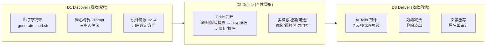

# `taste-driven-designer` 品味驱动设计技能架构设计书 (Architecture & Design Specification)

> **文档控制信息**
> - **文档标识**: SKILL-DES-TASTE-DRIVEN-DESIGNER-2026
> - **当前版本**: V1.1.0（三信号门禁版）
> - **文档所有者**: 核心架构组
> - **生效日期**: 2026-09-20
> - **理论基准**: [《How to Turn Your AI into a World-Class Designer》](../../reference/articles/how-to-turn-your-ai-into-a-world-class-designer.md)（Anshu Chimala，REF-ART-AI-DESIGNER-2026）
> - **变更说明**: V1.1.0 依据实跑反证将「Critic 绝对评分门禁」升级为「三信号门禁」，与原文章的显式偏离见 §8.1；反证证据见 `skills/taste-driven-designer/tests/fixtures/critic-gate-counter-evidence.md`

---

## 1. 背景与目标 (Problem & Goals)

LLM 是 Next-Token Predictor + RLHF 的产物：每次设计决策（配色、布局、文案）都倾向选择"最可能取悦大多数人的安全 Token"。结果是千篇一律的 AI Slop——紫色渐变、左文右图 Hero、Bento 卡片、营销空话。**模型不是瓶颈，工作流才是**：多数使用者只触发了模型约 1% 的创意潜力。

结构目标（对齐仓库既有技能规格）：

1. **可执行**：把方法论落成可运行的阶段门禁（D1 发散 → D2 打磨 → D3 收敛），而非抽象建议；
2. **宿主无关**：Critic 派发、截图捕获、图像/视频增强全部按宿主能力门控，缺能力即降级，不绑定任何厂商工具；
3. **可核验**：完成判据由「结构清单 + 盲比改进 + 人类签收」三信号构成，配合评审账本与 5 轮预算，让"设计好不好"从主观争论变成可审计轨迹；绝对分数只作遥测。

---

## 2. 理论支柱 (Theoretical Pillars)

| 支柱 | 来源 | 对应机制 |
|---|---|---|
| **AI 双钻模型**（Discover / Define / Deliver） | Anshu Chimala 重构版 | SKILL.md 三阶段路由，见 §3 |
| **String Seed of Thought** | Sakana AI 公开论文 | `scripts/generate-seed.sh` 外部随机种子；口头"随机指令"明确判无效 |
| **分离式批判 (Separated Critic)** | 文章 Technique 3 | 全新上下文 + 固定模板 + 只看产物的 Critic 闭环；签收权在人（三信号门禁） |
| **多模态资产** | 文章 Technique 4/5 | 能力门控增强层：图像生成 + 视频动效（循环抠像 / 关键帧插值） |
| **残酷减法与 AI Tells** | 文章 Technique 6/7/8 | 7 大反模式清单 + 减法规则 + 文案黑名单 |

**黄金公式**：`World-Class AI Design = 外部随机种子 + 独立 Critic 闭环 + 多模态增强 + 残酷减法`。

---

## 3. 三阶段流程拓扑 (Three-Stage Process Topology)

**阶段门禁**（流程的硬边界）：
- D1 出口：≥2 份方向简报 + 用户选定方向；
- D2 出口：三信号同时满足——结构清单全过 + 盲比有改进（或判定收敛）+ 人类签收（评审账本落盘）；
- D3 出口：7 反模式逐项过审 + 删除清单 + 文案黑名单清零。

---

## 4. Critic 闭环设计 (Critic Loop Design)

### 4.1 为什么必须分离
实现者自带代码、决策与理由进入审查时无法 zoom out——自我美化是 LLM 的天然倾向。Critic 的成立前提是**信息隔离**：

| 输入 | 允许 | 禁止 |
|---|---|---|
| 当前产物截图 / 降级结构化摘要（带版本 nonce） | ✅ | — |
| 设计意图与约束（方向、禁忌、**已决原则台账**） | ✅ | — |
| 上一版产物（仅盲比模式，左右随机去标识） | ✅ | — |
| 实现代码、实现细节 | ❌ | 只有产物 |
| 前次批评、历史迭代 | ❌ | 由主智能体消化转译（冲突按 §4.3 仲裁） |

### 4.2 三信号门禁与收敛
- **Gate A 结构清单**：7 AI Tells + 层级/间距/状态/文案审计，逐项可核验（客观、低噪声）；
- **Gate B 盲比改进**：上一版 vs 当前版强制选择（左右随机、去标识），输出"哪个更好 + 胜出维度"；不得输出分数；"无法区分"是合法结论；
- **Gate C 人类签收**：创意总监基于盲比轨迹、清单结果与未决分歧明确放行；
- **参考排序**（基线/争议）：一屏 "4 专业参考 + 1 产物" 输出 1..5 名次与关键差距，硬禁数值评分；
- **遥测分数**：若记录 x/10，需锚点示例 + 双 Critic 中位数，只进遥测栏，永不参与门禁判定；
- **预算**：冷启动 1~2 轮验证盲比信号有效；累计派发硬上限 5 轮（作废轮次不计），达限熔断上报用户。

### 4.3 鉴别力自检与冲突仲裁
- **回执与匿名性**：每轮用与候选身份无关的**轮次 nonce** 回执；版本标识只进账本、不进送审画面；回执缺失/不匹配/空白产物 → 该轮作废不入账，**连续 2 轮作废即停止并升级**（产物管线故障）；
- **鉴别力自检**：输入实质不同而输出逐字一致 → 判定 Critic 失效，立即升级人工，不再消耗轮次；
- **原则优先**：建议与「已决原则台账」冲突时，原则优先并记入台账，交人类裁决；
- **防乒乓**：同一维度前后两轮建议反转 → 冻结该维度，交人类裁决后执行。

### 4.4 与仓库既有技能的协同
- **宿主无关派发**：复用 `dual-round-review` 的派发模型约定（能力优先、同步/异步按返回语义分流、上下文隔离）；
- **对象不同**：dual-round-review 审**代码正确性**，本技能 Critic 审**视觉品味**；两者不互相替代；
- 执行技能（frontend-design / canvas-design / web-artifacts-builder 等）在本技能选定方向后作为 D2/D3 的落地工具被调度。

---

## 5. 能力门控矩阵 (Capability Gating Matrix)

| 宿主能力 | 默认路径 | 缺失时的降级 |
|---|---|---|
| 截图能力 | D2/D3 真截图 Critic 评审 | 结构化摘要评审（语义树 + 视觉参数 + 关键区段，脱敏实现意图） |
| 图像生成 | 增强层 1：真实图像资产（玻璃/3D/贴图） | 代码级质感（着色器 / CSS 纹理），跳过增强 |
| 视频生成 | 增强层 2：循环抠像资产 + 关键帧插值转场 | 跳过动效增强，保留 CSS 过渡品质 |

**总原则**：能力有则用、无则降级或跳过，**永远不假装有截图**。

---

## 6. 角色模型 (Role Model)

| 角色 | 承担者 | 职责边界 |
|---|---|---|
| **创意总监 (Creative Director)** | **人类（用户）** | 方向裁决、品味标杆、签收放行、冲突与乒乓的最终仲裁 |
| **Critic (品味裁判)** | 昂贵强视觉模型，独立子智能体 | 盲比选择 / 排序定位、指出 AI tells 与最高杠杆删除项；不写代码、不签收 |
| **实现者 (主智能体)** | 主流执行模型 | 生成 nonce、派发与回执校验、账本记账、按裁决精准修改 |

仓库既有 `goal-loop` 重型任务若含设计子阶段，可把本技能挂载为其中的设计执行模块；独立 UI 设计任务则直接以本技能为主流程。

---

## 7. 质量指标与测试策略 (Quality Metrics & Test Strategy)

| 层次 | 指标/门禁 |
|---|---|
| **L0 静态** | `bash -n` 脚本语法、`git diff --check` 零空白残留 |
| **L1 单元** | `pytest`：seed 脚本默认参数/边界校验/确定性模式（与 Python 复刻 Park-Miller 结果逐字节一致）/真随机多样性 —— 13 用例全绿 |
| **L1 契约** | `pytest`：门禁契约静态回归 **9 用例**——句子级扫描拦截"分数=完成/放行"的措辞变体（含规避实验验证），并钉死三信号锚点、盲比上一版例外、轮次 nonce 与匿名性、作废二级上限、回归维度字段、台账与账本 |
| **L-Doc 治理** | `check-doc-links.py` 全域断链 0；`audit-doc-health.py` 健康度 PASS |
| **方法论保真** | 8 大技法（种子/雄心 Prompt/独立批评/图像/视频/减法/AI Tells/文案重写）逐项在 references 中可寻址；与文章原意的偏离在 §8.1 显式登记——由红队终审核验 |

---

## 8. 边界与不承诺 (Boundaries & Non-Goals)

- 不实现截图捕获、图像/视频生成的宿主绑定代码——只提供协议与门控；
- 不承诺"无 AI 痕迹"的事实保证——只提供审计流程与黑名单；
- 不承诺绝对分数具备跨任务可比性——无锚点分数不构成任何判据；
- 不覆盖纯后端/数据逻辑任务；非视觉诉求不触发本技能；
- 不修改仓库既有技能与第三方锁定技能本体。

### 8.1 与文章原意的显式偏离 (Registered Deviations)

| # | 文章原意 | 本技能 V1.1 的处置 | 依据 |
|:---:|---|---|---|
| D1 | "Your work is only complete when the critic independently deems it 9/10 or higher." | 不把任何绝对分数作为完成判据；分数降为遥测（需锚点 + 双 Critic 中位数） | 实跑反证：评分区间压缩、与改动无相关、输入实质变化而输出逐字相同（E1/E2/E3） |
| D2 | 判据设计一节推荐「4 专业参考 + 1 自品」相对排序 | 升为与盲比并列的**主路径**，并硬性禁止数值评分输出（只允许 1..5 名次与差距） | 原实现将其降级为"可选变体"且实际退化为打分（E4） |
| D3 | "Invoke the critic in a fresh context, with just the screenshot, not the code, implementation details, or earlier iterations/critiques."（文章 L219） | Critic 额外接收**设计意图与已决原则台账**（仍不接收代码与实现细节） | E5/E6：无意图输入的评审凭空发明需求（"伪终端装饰"）并与已决规范「线胜于面」冲突；隔离的对象是**实现**，不是**意图** |
