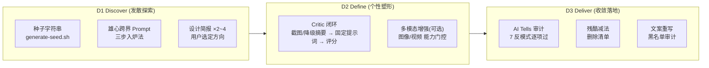

# `taste-driven-designer` 品味驱动设计技能架构设计书 (Architecture & Design Specification)

> **文档控制信息**
> - **文档标识**: SKILL-DES-TASTE-DRIVEN-DESIGNER-2026
> - **当前版本**: V1.0.0
> - **文档所有者**: 核心架构组
> - **生效日期**: 2026-09-20
> - **理论基准**: [《How to Turn Your AI into a World-Class Designer》](../reference/articles/how-to-turn-your-ai-into-a-world-class-designer.md)（Anshu Chimala，REF-ART-AI-DESIGNER-2026）

---

## 1. 背景与目标 (Problem & Goals)

LLM 是 Next-Token Predictor + RLHF 的产物：每次设计决策（配色、布局、文案）都倾向选择"最可能取悦大多数人的安全 Token"。结果是千篇一律的 AI Slop——紫色渐变、左文右图 Hero、Bento 卡片、营销空话。**模型不是瓶颈，工作流才是**：多数使用者只触发了模型约 1% 的创意潜力。

结构目标（对齐仓库既有技能规格）：

1. **可执行**：把方法论落成可运行的阶段门禁（D1 发散 → D2 打磨 → D3 收敛），而非抽象建议；
2. **宿主无关**：Critic 派发、截图捕获、图像/视频增强全部按宿主能力门控，缺能力即降级，不绑定任何厂商工具；
3. **可量化**：Critic 独立评分（9/10 收敛线）与迭代预算（5 轮熔断）让"设计好不好"从主观争论变成可审计轨迹。

---

## 2. 理论支柱 (Theoretical Pillars)

| 支柱 | 来源 | 对应机制 |
|---|---|---|
| **AI 双钻模型**（Discover / Define / Deliver） | Anshu Chimala 重构版 | SKILL.md 三阶段路由，见 §3 |
| **String Seed of Thought** | Sakana AI 公开论文 | `scripts/generate-seed.sh` 外部随机种子；口头"随机指令"明确判无效 |
| **分离式批判 (Separated Critic)** | 文章 Technique 3 | 全新上下文 + 固定提示词 + 只看产物的 Critic 闭环；达标线保密 |
| **多模态资产** | 文章 Technique 4/5 | 能力门控增强层：图像生成 + 视频动效（循环抠像 / 关键帧插值） |
| **残酷减法与 AI Tells** | 文章 Technique 6/7/8 | 7 大反模式清单 + 减法规则 + 文案黑名单 |

**黄金公式**：`World-Class AI Design = 外部随机种子 + 独立 Critic 闭环 + 多模态增强 + 残酷减法`。

---

## 3. 三阶段流程拓扑 (Three-Stage Process Topology)

**阶段门禁**（流程的硬边界）：
- D1 出口：≥2 份方向简报 + 用户选定方向；
- D2 出口：Critic 独立评分 ≥9/10（评分轨迹落盘）；
- D3 出口：7 反模式逐项过审 + 删除清单 + 文案黑名单清零。

---

## 4. Critic 闭环设计 (Critic Loop Design)

### 4.1 为什么必须分离
实现者自带代码、决策与理由进入审查时无法 zoom out——自我美化是 LLM 的天然倾向。Critic 的成立前提是**信息隔离**：

| 输入 | 允许 | 禁止 |
|---|---|---|
| 当前产物截图 / 降级结构化摘要 | ✅ | — |
| 实现代码、实现细节 | ❌ | 只有产物 |
| 前次批评、历史迭代 | ❌ | 由主智能体消化转译 |

### 4.2 评分与收敛
- **绝对标尺**：7 = 普通 agency 水准，9 = 获奖级定制工艺；收敛线 9/10 只存在于主智能体侧，**严禁写入 Critic 提示词**（防止客观打分被目标污染）；
- **相对基线**（争议时）：一屏 "4 专业参考 + 1 产物" 排序法，把主观美感争议降维为相对比较；
- **预算**：冷启动 1~2 轮验证可收敛性；总迭代上限 5 轮；连续 ≥3 轮评分不涨熔断上报用户。

### 4.3 与仓库既有技能的协同
- **宿主无关派发**：复用 `dual-round-review` 的派发模型约定（能力优先、同步/异步按返回语义分流、上下文隔离）；
- **对象不同**：dual-round-review 审**代码正确性**，本技能 Critic 审**视觉品味**；两者不互相替代；
- 执行技能（frontend-design / canvas-design / web-artifacts-builder 等）在本技能选定方向后作为 D2/D3 的落地工具被调度。

---

## 5. 能力门控矩阵 (Capability Gating Matrix)

| 宿主能力 | 默认路径 | 缺失时的降级 |
|---|---|---|
| 截图能力 | D2/D3 真截图 Critic 评审 | 结构化摘要评审（语义树 + 视觉参数 + 关键区段，脱敏实现意图） |
| 图像生成 | 增强层 1：真实图像资产（玻璃/3D/贴图） | 代码级质感（着色器 / CSS 纹理），跳过增强 |
| 视频生成 | 增强层 2：循环抠像资产 + 关键帧插值转场 | 跳过动效增强，保留 CSS 过渡品质 |

**总原则**：能力有则用、无则降级或跳过，**永远不假装有截图**。

---

## 6. 角色模型 (Role Model)

| 角色 | 承担者 | 职责边界 |
|---|---|---|
| **创意总监 (Creative Director)** | **人类（用户）** | 方向裁决、品味标杆、熔断仲裁、删除决策的最终拍板 |
| **Critic (品味裁判)** | 昂贵强视觉模型，独立子智能体 | 只看产物、给点评、给分数；不写代码 |
| **实现者 (主智能体)** | 主流执行模型 | 消化批评为修复项、精准修改、转录评分轨迹 |

仓库既有 `goal-loop` 重型任务若含设计子阶段，可把本技能挂载为其中的设计执行模块；独立 UI 设计任务则直接以本技能为主流程。

---

## 7. 质量指标与测试策略 (Quality Metrics & Test Strategy)

| 层次 | 指标/门禁 |
|---|---|
| **L0 静态** | `bash -n` 脚本语法、`git diff --check` 零空白残留 |
| **L1 单元** | `pytest`：seed 脚本默认参数/边界校验/确定性模式（与 Python 复刻 Park-Miller 结果逐字节一致）/真随机多样性 —— 10 用例全绿 |
| **L-Doc 治理** | `check-doc-links.py` 全域断链 0；`audit-doc-health.py` 健康度 PASS |
| **方法论保真** | 8 大技法（种子/雄心 Prompt/独立批评/图像/视频/减法/AI Tells/文案重写）逐项在 references 中可寻址——由红队终审核验 |

---

## 8. 边界与不承诺 (Boundaries & Non-Goals)

- 不实现截图捕获、图像/视频生成的宿主绑定代码——只提供协议与门控；
- 不承诺"无 AI 痕迹"的事实保证——只提供审计流程与黑名单；
- 不覆盖纯后端/数据逻辑任务；非视觉诉求不触发本技能；
- 不修改仓库既有技能与第三方锁定技能本体。
