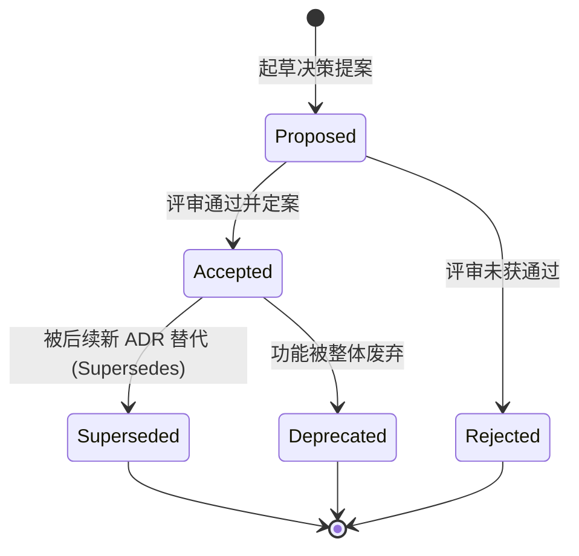

# MADR 3.0 架构决策记录规范 (Architectural Decision Record Standard)

> **控制信息**
> - **规范版本**: V1.0.0
> - **理论来源**: MADR 3.0 (Markdown Architectural Decision Records) / Michael Nygard ADR
> - **适用范围**: 所有关键技术选型、重大架构分层与不可逆技术决策治理

---

## 1. 核心理念与不可篡改原则 (Append-Only Principle)

架构决策记录（ADR）是用于捕获软件系统中**重大技术决策、上下文背景及其带来的长远后果**的轻量级结构化文本。

### 核心铁律
1. **Append-Only（只追加，不篡改）**：
   - 任何已被标记为 `Accepted` 的 ADR，**严禁在日后直接原地修改其核心决策内容**；
   - 历史决策是系统在特定时间、特定资源和约束条件下的最佳判断，必须保持历史证据保真。
2. **Supersede（以新代旧，显式演化）**：
   - 如果未来业务发展需要推翻旧决策（例如从 SQLite 迁移到 PostgreSQL），必须**新建一条全新的 ADR**（如 `0005-migrate-to-postgresql.md`）；
   - 在新 ADR 头部显式声明 `Supersedes: ADR-0002`，并将旧 ADR 状态更新为 `Superseded`，同时双向建立物理超链接。

---

## 2. ADR 存放目录与编号命名规范

* **存放路径**：`docs/explanation/decisions/`
* **命名格式**：`{4位连续序号}-{kebab-case-英文命名}.md`
  - 示例：`0001-use-zustand-for-state-management.md`
  - 示例：`0002-dual-round-review-protocol.md`
  - 示例：`0003-diataxis-documentation-standard.md`
* **序号单调递增**：从 `0001` 开始依次递增，不可跳号或复用已废弃序号。

---

## 3. MADR 3.0 标准模板 (MADR 3.0 Specification)

```markdown
# ADR-{序号}: {决策简述 (动词+名词)}

> **ADR 控制元数据**
> - **决策编号**: {4位数字} (如 0001)
> - **当前状态**: [Proposed | Accepted | Rejected | Deprecated | Superseded by ADR-xxxx]
> - **决策所有者**: [负责人/架构师]
> - **决议日期**: YYYY-MM-DD
> - **关联需求/RFC**: [RFC-0001-xxx.md](../../proposals/RFC-0001-xxx.md)

---

## 1. 背景与上下文 (Context and Problem Statement)
- 面临的现实技术或业务问题是什么？
- 有哪些硬性约束（性能、安全性、团队技术栈、上线时间窗口）？
- 为什么现状已经无法支撑未来的需求？

## 2. 考虑的备选方案 (Considered Options)
* **方案 1**: {备选方案 1 名称}
* **方案 2 (选定)**: {备选方案 2 名称}
* **方案 3**: {备选方案 3 名称}

## 3. 最终决策与裁决 (Decision Outcome)
选定 **方案 2**，原因是 {用一句话概括最核心的决定性理由}。

### 3.1 积极后果 (Positive Consequences)
* ✅ 优势 1: ...
* ✅ 优势 2: ...

### 3.2 消极后果与已知代价 (Negative Consequences / Trade-offs)
* ⚠️ 劣势/成本 1: 学习曲线略高，需配套教程...
* ⚠️ 劣势/成本 2: 初期包体积增加约 15KB...

---

## 4. 备选方案详细对比与论证 (Pros and Cons of the Options)

### 4.1 方案 1: {方案 1 名称}
* 概况: ...
* 赞同理由 (+): ...
* 反对理由 (-): 缺乏类型安全支持，并发下存在隐患（决定性否决点）。

### 4.2 方案 2: {方案 2 名称} (选定)
* 概况: ...
* 赞同理由 (+): 完全符合不可变数据流，生态成熟。
* 赞同理由 (+): 社区活跃度高，维护成本低。
* 反对理由 (-): API 语法较繁琐。

### 4.3 方案 3: {方案 3 名称}
* 概况: ...
* 反对理由 (-): ...

---

## 5. 验证与落地指引 (Validation and Implementation)
- 对应的实现 Commit SHA 或 PR 编号；
- 验收命令或基准测试（Benchmark）数据支撑。
```

---

## 4. 决策生命周期状态机


