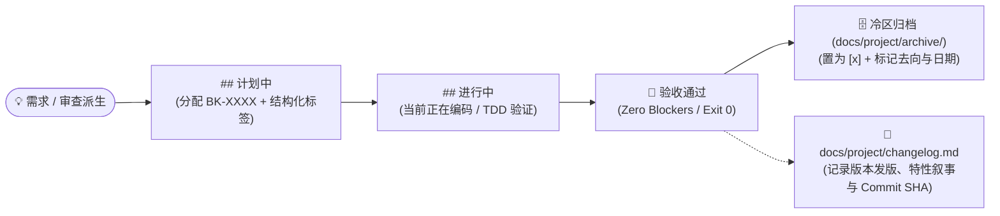

# Backlog 体系与生命周期规范 (Backlog System Specification)

> **文档控制信息**
> - **规范版本**: V2.0.0
> - **适用范围**: `docs/project/backlog.md`（热区）及 `docs/project/archive/`（冷区）的条目契约、冷热分片流转、结构化标签、去向闭环与跨文档引用
> - **设计动机**: 
>   1. 彻底根治单体巨石 Backlog 膨胀（解决 AI 上下文吞噬、46KB 工具截断、400 行大宽表维护脆弱性）；
>   2. 建立工业级多维元数据契约（类型、优先级、触发时机、来源追溯、验收准则、去向闭环）；
>   3. 确立基于脚本判定的指标统计与门禁巡检，杜绝自然语言“算术对账日记”与账本漂移。

---

### 修订历史记录 (Revision History)

| 版本号 | 修订日期 | 修订人 | 审核人 | 修订描述 |
| :--- | :--- | :--- | :--- | :--- |
| V2.0.0 | 2026-10-04 | AI Agent | 王辉 | **Backlog 体系架构级升级**：确立冷热物理隔离架构（热区仅保留进行中/计划中，关闭项归档至冷区）；升级标准化结构化条目契约（BK 编号 + 多维标签 + 验收准则 + 去向闭环）；引入机器自动指标计算与门禁，严禁手写对账日记。 |
| V1.0.0 | 2026-09-30 | AI Agent | 王辉 | 初始版本：建立 `BK-0001` 格式行内编号规范、三区流转及单事实源关闭条款。 |

---

## 1. 核心拓扑：冷热物理隔离架构 (Cold-Hot Partitioning)

在 AI Coding 时代，上下文窗口（Context Window）是最稀缺的资源。积压数十甚至上百条历史关闭项不仅浪费 Token，还会引发模型的“注意力稀释（Lost in the Middle）”。Backlog 实行严格的**冷热物理隔离**：

```text
docs/project/
├── roadmap.md             # 产品规划路线图与版本里程碑矩阵 (宏观)
├── changelog.md           # 版本发布日志与交付物归档 (已落地特性的技术叙事单一事实源)
├── backlog.md             # 【热区 / Active Pool】现役待办清单 (进行中 + 计划中，高信噪比)
└── archive/               # 【冷区 / Cold Storage】历史已结项待办归档
    ├── backlog-v0.9.md    # 按大版本归档的已关闭条目 (只追加、不修改)
    └── backlog-2026-Q3.md # 或按季度归档的已关闭条目
```

### 1.1 热区待办池 (`docs/project/backlog.md`)
* **职责定位**：仅承载“未来待办”与“在途任务”，是智能体寻找下一阶段目标的核心热上下文；
* **固定分区**：
  ```markdown
  # 现役待办与后续方向 (Active Backlog)
  ## 进行中      # 当前正在推进的条目（编号保持，可为空）
  ## 计划中      # 已入库待开工的条目（新增条目的默认落点）
  ```
* **规模控制红线**：
  * 原则上单文件不超过 **200 行**，文件体积严格控制在 **30 KB** 以内；
  * 活跃条目上限推荐控制在 **50 条** 以内。超过 60 条必须触发理牌（Grooming / Backlog Refinement）；
* **纯粹性负向红线**：
  * ⛔ **严禁在热区长期堆积已关闭条目**：条目一旦完成，必须在当期交付批次物理迁出至冷区归档文件；
  * ⛔ **严禁在 Backlog 混合已落地长篇叙事**：已完成特性的技术细节、Commit SHA 与设计复盘统一归入 `docs/project/changelog.md`，严禁在 Backlog 编写特性叙事；
  * ⛔ **严禁手写自然语言算术对账日记**：严禁在文档内手写类似“活跃项 30→34、46=A0+B2+C1...”等算术过程，指标统计全部由 `audit-doc-health.py` 动态扫描输出。

### 1.2 冷区历史归档 (`docs/project/archive/backlog-*.md`)
* **职责定位**：永久沉淀已结项条目的历史记录、结项日期与去向闭环；
* **分片策略**：
  * **按版本分片（推荐）**：如 `archive/backlog-v0.8.md`、`archive/backlog-v0.9.md`；
  * **按周期分片**：如 `archive/backlog-2026-Q3.md`；
* **归档原则**：只追加、不修改。日常开发不加载冷区文件，仅在全量回溯或版本审计时按需调取。

---

## 2. 条目编号与结构化契约 (Structured Backlog Contract)

### 2.1 编号规则 (BK Identifier)
1. **格式**：`BK-{4 位零填充序号}`，如 `BK-0001`、`BK-0157`，上限 `BK-9999`；
2. **位置**：紧跟复选框之后，支持粗体高亮：`- [ ] **BK-0013** ...`；
3. **赋号**：新条目编号 = 全项目（包含热区 `backlog.md` 与冷区 `archive/backlog-*.md`）当前最大编号 + 1；
4. **只增不复用**：编号一经分配即永久绑定该条目。条目关闭归档后编号随之移入冷区；条目被废弃（Won't Fix）时其编号永久空缺，严禁补位回收；
5. **仅顶层条目编号**：嵌套子项不编号、不独立引用。

### 2.2 结构化条目契约（形态 A：紧凑结构化行，推荐基线）
为兼顾人类高可读性与智能体高解析度，条目采用**带语义标签的紧凑结构化契约**：

```markdown
- [ ] **BK-0157** `[Type:TechDebt]` `[Pri:P2]` `[Trigger:文献库>1000篇]` 文献聚合的服务端分页与截断可观测性
  - **来源**: [RFC-0003 §8](../proposals/RFC-0003.md) / [P3 批次 2 审查报告](file:///path/to/review.md)
  - **验收**: 超过 1000 篇时返回 truncated=true 标志与截断告警，自动化集成用例覆盖边界
```

#### 维度元数据标签字典
| 维度标签 | 取值枚举 | 语义与应用场景 |
| :--- | :--- | :--- |
| **`Type` (类型)** | `Feature` | 新增产品功能、业务用例或用户界面 |
| | `TechDebt` | 技术债务清理、代码重构、契约偏差对齐 |
| | `Bug` | 线上缺陷修复、逻辑漏洞修复 |
| | `Security` | 安全加固、权限隔离、鉴权校验强化 |
| | `Governance` | 门禁规则、CI 脚本、文档同步与规范演进 |
| | `Performance` | 性能调优、缓存优化、高并发与内存治理 |
| **`Pri` (优先级)** | `P0` | 阻断级缺陷、安全漏洞、当前版本核心卡点 |
| | `P1` | 高优先级、下一里程碑必备范围项 |
| | `P2` | 中优先级、正常演进与维护待办 |
| | `P3` | 低优先级、边缘体验优化、长期观察项 |
| **`Trigger` (时机/条件)** | *(自由字符串)* | **可选**。标注明确触发条件，如 `[Trigger:多实例部署时]`、`[Trigger:v1.0.0]`、`[Trigger:数据量>1000]`，防止非版本背账 |

#### 结构化子项（2~3 行精炼定义）
* **来源 (Source)**：必须明确记录本待办由何处派生（例如：`[RFC-0006 §4.2](../proposals/RFC-0006.md)`、`R2 元审判 Blockers 裁决`、`用户明确指令`、`实验结论`）；
* **验收 (Acceptance)**：必须提供清晰、可断言的完成标准（Definition of Done），例如“自动化测试 Exit 0”、“门禁断言覆盖”、“UI 状态正确呈现”；
* **去向 (Destination)**：**关闭条目时必须填写**（见第 3 节）。

---

### 2.3 形态 B：目录分片式 / Issue-as-File (针对复杂系统与多智能体并行)

对于技术债数量庞大（数十到数百条）、条目本身携带丰富诊断上下文、变异检验要求或实验记录的核心系统，**全量推荐采用形态 B（Issue-as-File）**。

#### 2.3.1 目录拓扑结构
```text
docs/project/backlog/
├── index.md             # 机器自动生成的活跃待办汇总视图 (包含仪表盘与分层表格，由脚本自动维护)
├── active/              # 活跃待办卡片池 (所有处于 active / in-progress 状态的文件)
│   ├── BK-0157-literature-aggregate-pagination.md
│   └── BK-0158-field-id-normalization-parity.md
└── archive/             # 历史已结项卡片池 (按大版本或年份季度子目录物理隔离)
    ├── v0.8/
    │   └── BK-0050-micro-sandbox-env.md
    └── v0.9/
        └── BK-0147-payload-volume-fuse.md
```

#### 2.3.2 标准 YAML Frontmatter 元数据契约
每个待办文件（`active/BK-XXXX-*.md`）顶部必须包含标准化 YAML Frontmatter，确保机器与脚本可精确解析：

```yaml
---
id: BK-0157
title: 文献聚合的服务端分页与截断可观测性
type: TechDebt          # Feature | TechDebt | Bug | Security | Governance | Performance
status: active          # active | in-progress | completed | rejected | deferred
priority: P2            # P0 | P1 | P2 | P3
trigger: 文献库>1000篇   # 触发条件（可选，非版本背账）
created_at: 2026-09-23
updated_at: 2026-10-04
closed_at: null         # 结项/关闭日期 (YYYY-MM-DD)
resolution: null        # delivered | superseded | wontfix
destination: null       # 交付物去向或关联 Commit / PR / 计划文档
source:
  - RFC-0003 §8
  - P3 批次 2 审查报告 R1
acceptance_criteria:
  - 命中上限返回 truncated=true 标志与截断告警
  - 自动化集成用例覆盖边界
---
```

#### 2.3.3 正文标准模板
```markdown
## 1. 背景与问题陈述
详细分析当前痛点、历史成因与复现路径。

## 2. 影响面与技术考量
- 涉及模块 / 接口
- 并发、锁与安全性考量

## 3. 验收准则与验证设计 (DoD)
- [ ] 核心功能通过自动化单元测试验证
- [ ] 边界与变异测试用例双向成立

## 4. 实施去向与结项记录
*(未开工；结项时由 close 指令自动追加)*
```

#### 2.3.4 脚本化提取与可编程运维工具 (`manage-backlog.py`)
为方便人类与 AI 智能体程序化读取、过滤和流转待办，提供配套脚本 `scripts/manage-backlog.py`：

```bash
# 1. 脚本化提取：查询所有处于 active 状态的 P1 待办 (表格输出)
python3 skills/doc-governance/scripts/manage-backlog.py list --status active --priority P1

# 2. 机器流转：输出纯 JSON 数组，供其他 AI 智能体消费执行
python3 skills/doc-governance/scripts/manage-backlog.py list --status active --json

# 3. 快速创建新待办 (自动分配 BK 递增编号，创建卡片并刷新 index.md)
python3 skills/doc-governance/scripts/manage-backlog.py create "文献地图配色下限加固" \
  --type TechDebt --priority P2 --source "R1 审查建议" --acceptance "通过 OKLab 色差断言"

# 4. 结项归档 (更新元数据为 completed，物理迁入 archive/v0.9/ 目录并自动刷新 index.md)
python3 skills/doc-governance/scripts/manage-backlog.py close BK-0157 \
  --resolution delivered --dest "v0.10.0 I3 交付" --version "v0.10.0"

# 5. 手动重新生成 index.md 索引页
python3 skills/doc-governance/scripts/manage-backlog.py sync-index
```

---

## 3. 条目生命周期与归档闭环 SOP (Lifecycle & Archival)

条目在研发流程中严格遵循状态机流转，严禁越级或残留：



### 3.1 四阶段流转动作表
| 阶段 | 物理操作动作 | 规范要求 |
| :--- | :--- | :--- |
| **1. 入库** | 新条目追加到 `backlog.md` 的 `## 计划中` | 按第 2 节规则计算并分配编号，补齐 `Type`、`Pri` 与 **来源**、**验收**。 |
| **2. 开工** | 条目（含子项）整体剪切移入 `backlog.md` 的 `## 进行中` | 编号与标签保持不变，同一会话进行中的任务原则上不超过 3 个。 |
| **3. 结项归档** | 条目（含子项）整体从 `backlog.md` 剪切，**移入冷区 `docs/project/archive/backlog-*.md` 顶部** | 状态置为 `[x]`，并追加 **去向** 与 **关闭日期**（`YYYY-MM-DD`）。<br>示例：`- [x] **BK-0157** ... ➔ [已在 v0.10.0 I3 闭环交付，2026-10-04]`。 |
| **4. 发版沉淀** | 在 `docs/project/changelog.md` 追加发版记录与 Commit SHA | **单一事实源原则**：特性的技术沉淀与 Commit SHA 只记录于 changelog，严禁在 Backlog 重复维护 SHA。 |

---

## 4. 跨文档引用约定

在撰写提交信息、变更日志、计划文档或审查报告时，一律使用稳定的 BK 编号进行双向锚定：
* **Commit Message**: `fix(literature): 修复文献聚合分页截断问题 (关闭 BK-0157)`
* **Changelog**: `- 落地文献聚合服务端分页与截断感知能力 (BK-0157, RFC-0003)`
* **RFC 结晶拆片**: `本方案拆解为以下工程待办：BK-0241, BK-0242, BK-0243`
* **双轮审查派生**: `R1 红队审查派生 2 项技术债：录入 BK-0244, BK-0245`

严禁以条目措辞文本或模糊描述作为引用键。

---

## 5. 自动化审计与对账门禁 (Audit & Machine Verifiability)

为消除“手工对账日记”并确保规范刚性落地，`scripts/audit-doc-health.py` 集成自动化 Backlog 巡检门禁：

### 5.1 机械阻断项 (Hard Blockers ➔ 导致 Gate REJECTED)
1. **顶层条目缺号**：热区或冷区存在未标有 `BK-XXXX` 的顶层复选框条目；
2. **全局编号冲突**：在全域（热区 + 所有冷区归档文件）中出现相同的 `BK-XXXX` 编号；
3. **格式畸变**：编号未紧跟复选框（例如位置错位、缺少空格等）。

### 5.2 卫生巡检告警 (Hygiene Warnings ➔ 提示整改)
1. **冷热分离违规**：`backlog.md` 中存在已完成项（`[x]`）或包含 `## 已关闭` 分区，体检告警提示及时迁出归档；
2. **热区体积超标**：`backlog.md` 物理行数超过 **300 行** 或活跃条目超过 **60 条**，告警提示执行 Backlog 理牌与归档；
3. **元数据缺失**：活跃待办未标注 `[Type:...]` 或 `[Pri:...]`。

### 5.3 自动化指标仪表盘（消灭自然语言手写对账）
运行 `audit-doc-health.py` 时，脚本自动统计并输出 Backlog 真实指标：
```text
📋 [Backlog 演进与待办健康仪表盘]:
   * 活跃待办总数: 42 条 (进行中: 3 条, 计划中: 39 条)
   * 历史已归档数: 128 条 (归档目录: docs/project/archive/)
   * 优先级分布:   P0: 2, P1: 8, P2: 18, P3: 14
   * 领域类型分布: TechDebt: 22, Feature: 12, Security: 5, Bug: 3
```
人类与 AI 直接以该机器输出为准，**严禁在文档内编写任何形式的手动加减日记**。

---

## 6. 存量巨石待办平滑迁移指引 (Migration SOP to Form B)

针对存量项目中已积压形成巨石待办文档（例如 100 KB+、数百行宽表格、冷热数据混杂且含手工加减日记）的场景，提供以下标准迁移 SOP：

### 6.1 阶段一：冷热物理切割 (Extract Cold Data)
1. **冷数据归档**：
   - 将原文档中所有已关闭/已完成的条目（如“已完成清单”、“已结项分区”）提取移出；
   - 迁入 `docs/project/backlog/archive/<version>/` 目录（例如 `archive/2026/` 或 `archive/v1.0/`），以卡片或版本归档表形式固化；
2. **技术叙事归位**：
   - 将原待办中记录的历史特性叙事、重大重构细节整体合并至 `docs/project/changelog.md` 或独立架构决策记录（ADR），解除待办清单对交付叙事的越权承担；
3. **消除手工算术日记**：
   - 彻底删除原文档中各类“活跃待办快照”、“加减对账日记”等手工统计段落，统一交由 `manage-backlog.py` 机器脚本计算。

### 6.2 阶段二：活跃待办卡片化解构 (Decompose to Issue-as-File)
1. **初始化拓扑**：
   - 在项目中创建 `docs/project/backlog/active/` 与 `docs/project/backlog/archive/` 目录；
2. **批量录入活跃卡片**：
   - 针对仍处于“进行中”或“计划中”的待办，使用 `manage-backlog.py create` 或编写迁移脚本逐条提取生成卡片至 `active/`；
   - 补齐标准化元数据：稳定 `BK-XXXX` 编号、`priority` (P0-P3)、`type` (Feature/TechDebt/Bug 等)、`source` 与验收准则 (`acceptance_criteria`)；
3. **移除旧单体文件**：
   - 确认活跃卡片与冷区归档建立后，物理删除旧版单体 `backlog.md`（或 `后续优化方向汇总.md`）。

### 6.3 阶段三：机器索引构建与门禁验收 (Reindex & Verification)
1. **自动构建 Active 索引**：
   - 运行 `python3 scripts/manage-backlog.py --root docs sync-index`，自动生成包含健康仪表盘与按优先级排序的 `docs/project/backlog/index.md`；
2. **更新全局索引链接**：
   - 在项目主索引（如 `docs/index.md`）与相关计划文档中，将旧待办文件链接更新为 `docs/project/backlog/index.md`；
3. **门禁体检验收**：
   - 运行 `python3 scripts/audit-doc-health.py --root docs`，验证无重复编号、无断链且健康度达到 100 分。
