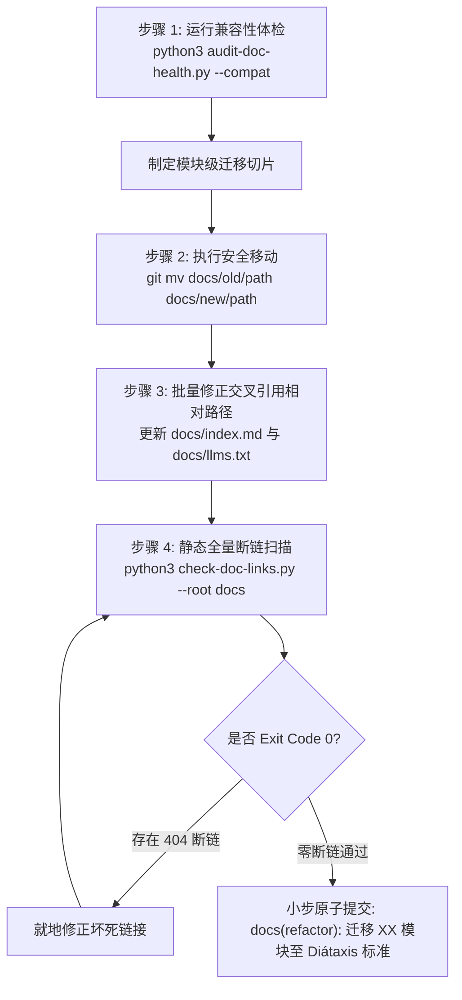

# 既有项目文档平滑迁移指南 (Legacy Documentation Migration Guide)

> **控制信息**
> - **规范版本**: V1.0.0
> - **核心原则**: 渐进式平滑演进，拒绝暴力休克重构，保证链接可溯源
> - **适用范围**: 协助采用旧瀑布周期目录（requirements, design, planning 等）的既有工程向 Diátaxis 标准迁移

---

## 1. 迁移核心原则与心智

许多既有项目（如单体项目早期）采用了按照软件生命周期切分的旧目录结构：
`docs/requirements/`、`docs/design/`、`docs/planning/`、`docs/operations/`。

向现代 Diátaxis + ADR 标准迁移时，必须遵循三项原则：
1. **渐进式演进（Progressive Migration）**：不要在一次提交中推倒一切，按模块或按功能特性小步迁移；
2. **Git 历史可审计（Preserve History via `git mv`）**：严禁直接通过文件系统删除再新建，必须使用 `git mv` 移动文件，保留 Git 提交日志与 blame 追踪；
3. **断链绝对防护（Zero Broken Links）**：移动任何文档后，必须更新所有引用该文件的相对路径，并同步更新 `docs/index.md`，使用 `check-doc-links.py` 严格验证。

---

## 2. 经典瀑布目录向 Diátaxis 现代目录完整映射表

| 既有老目录与文档形态 | Diátaxis 标准归属 | 映射目标路径 | 迁移操作要点 |
|:---|:---|:---|:---|
| `requirements/agent/*` | Technical Reference | `docs/reference/rules/` (或 `rules/agent-protocols.md`) | 协议与契约作为行为规约收敛至 rules 目录 |
| `requirements/backend/后端功能设计文档.md` | Reference + Explanation | 1. API 契约 ➔ `docs/reference/api/`<br>2. 数据模型 ➔ `docs/reference/models/`<br>3. 架构设计 ➔ `docs/explanation/architecture/` | 解构大杂烩：契约进参考，设计进剖析 |
| `requirements/frontend/前端功能设计文档.md` | Reference + Explanation | 1. 视觉规范 ➔ `docs/reference/ui/`<br>2. 交互拓扑 ➔ `docs/explanation/architecture/` | 样式 Token 与组件规范独立下沉 |
| `requirements/business/系统业务规则文档.md` | Technical Reference | `docs/reference/rules/` | 状态机流转图与权限规则作为绝对真理源保留 |
| `design/architecture/` | Explanation (Architecture) | `docs/explanation/architecture/` | 架构总纲与子系统架构剖析 |
| `planning/*选型评估.md` | Explanation (Analysis) | `docs/explanation/analysis/` | 历史技术调研与选型评估移入剖析象限 |
| `planning/*决策*.md` | Explanation (Decisions) | `docs/explanation/decisions/` | 按 4 位编号规范重构为 MADR 3.0 格式 |
| `operations/deployment.md` | How-To Guides | `docs/how-to/deployment.md` | 保留纯命令操作步骤，剔除长篇理论 |
| `operations/试用指南.md` | Tutorials | `docs/tutorials/onboarding.md` | 重构为新手 5 分钟上手体验向导 |
| `planning/*进度跟踪.md` | Project Evolution | `docs/project/changelog.md` | 演进为结构化版本变更发布日志 |
| `planning/后续优化方向汇总.md` | Project Evolution | `docs/project/backlog.md` | 统一维护的待办与技术债积压清单 |

---

## 3. 标准平滑迁移 4 步 SOP (Migration SOP)



### 步骤 1：规划受影响的范围
运行 `audit-doc-health.py --compat` 摸底既有知识库健康状态，明确本次迁移的目标模块。

### 步骤 2：使用 `git mv` 移动物理文件
```bash
# 示例：将业务规则迁移至 reference/rules
mkdir -p docs/reference/rules
git mv docs/requirements/business/系统业务规则文档.md docs/reference/rules/系统业务规则文档.md
```

### 步骤 3：修正受影响文档的相对引用
使用全局 grep 搜索旧文件名，将其相对超链接路径更新为新路径（保留 `.md` 后缀）。

### 步骤 4：门禁验证与原子提交
```bash
# 校验断链
python3 skills/doc-governance/scripts/check-doc-links.py --root docs
# 裁剪修订历史窗口
python3 skills/doc-governance/scripts/trim-revision.py --root docs --fix --keep 5
# 确认无误后提交
git commit -m "docs(refactor): 将业务规则文档迁移至 reference/rules 目录"
```
