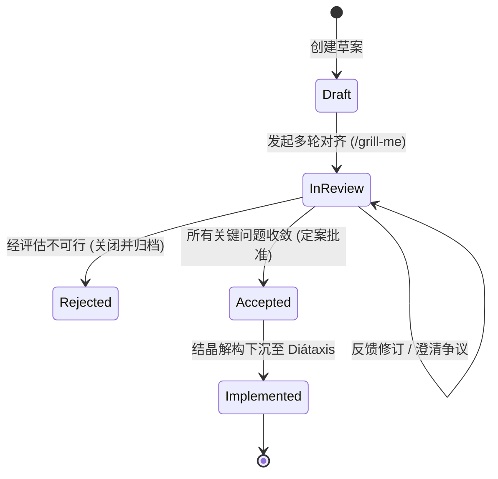

# RFC 提案孵化与 Diátaxis 结晶流转规程 (RFC-to-Crystallization Lifecycle Guide)

> **控制信息**
> - **规范版本**: V1.0.0
> - **设计来源**: Rust RFC / Kubernetes KEP / Daniele Procida Diátaxis 体系扩展
> - **适用范围**: 解决项目初期 (0-to-1) 及重大功能立项期需求设计高频对齐痛点

---

## 1. 为什么需要“孵化-结晶”两阶段模型？

在软件工程实践与多智能体协作中，存在一个根本性矛盾：
* **对齐期的高内聚诉求**：一个未成熟的架构或新功能构想，包含“为什么做（背景）”、“做什么（用户故事）”、“怎么做（草案）”以及“有哪些风险（未决问题）”。人类与智能体在开会、评审、或使用 `/grill-me` 盘问时，必须针对**单一连贯的文档**展开全貌审视。
* **稳态运行期的高正交诉求**：当系统落地后，为了让后续维护者与代码生成智能体低消耗、高精准地工作，文档必须严格按照 Diátaxis 正交分类（查接口去 Reference、查步骤去 How-To、查原理去 Explanation）。

如果一开始就把草案打散写入 Diátaxis：
1. **评审认知阻抗极高**：评审人需同时打开 5 个不同象限的文件拼凑逻辑；
2. **修改代价呈指数级倍增**：对齐中推翻一个假设，需同时翻修 5 处文件，极易造成半同步坏味道；
3. **严重污染机器唯一真相源**：未定型的假想 API 写入 `reference/api/`，会直接引发智能体在其他任务中生成幻觉代码。

因此确立**两阶段生命周期演进模型**：

```text
[阶段一: 需求与设计孵化期]                       [阶段二: 实施定案与结晶沉淀期]
docs/proposals/RFC-0001-xxx.md                 Diátaxis 四象限活文档体系
┌──────────────────────────────┐                ┌──────────────────────────────┐
│  - 背景与问题 (Why)           │                │ docs/reference/api/          │
│  - 用户故事与场景 (What)      │                │ 确立的权威 API 契约规格        │
│  - API / 数据模型草案 (Draft) │ ──结晶下沉──►   ├──────────────────────────────┤
│  - 架构设计草案 (Arch Draft)  │ (Crystallize)  │ docs/reference/models/       │
│  - 备选方案与权衡 (Trade-offs)│                │ 确立的权威领域数据模型        │
│  - 未决问题清单 (Open Qs)     │                ├──────────────────────────────┤
└──────────────┬───────────────┘                │ docs/explanation/decisions/  │
               │                                │ 提炼生成的不可篡改 MADR 记录  │
       状态流转: Accepted                       ├──────────────────────────────┤
               ▼                                │ docs/project/backlog.md      │
原 RFC 置为 Implemented 归档历史溯源             │ 任务拆解与开发排期            │
                                                └──────────────────────────────┘
```

---

## 2. 阶段一：提案孵化规范 (Proposal Incubation)

### 2.1 存储目录与命名规则
* **存储位置**：`docs/proposals/`
* **命名格式**：`RFC-{序号}-{短英文命名}.md`（如 `RFC-0001-canvas-collab.md`、`RFC-0002-memory-extractor.md`）；
* **语言原则**：正文使用项目主语言（如中文），标识符与文件名使用 kebab-case 英文。

### 2.2 状态机流转图 (Status Lifecycle)



* **Draft (草案)**：作者/智能体正在起草初步设计，方案骨架尚未完整；
* **In Review (评审对齐中)**：方案完整，正在经历人类工程师与 AI 智能体之间的密集盘问（Grilling）、推演与权衡评审；
* **Accepted (已定案)**：核心争议已达成共识，未决问题已全部关闭，准予正式进入编码实施；
* **Rejected (已否决)**：经评审技术路线不成熟或投产比不足，方案被否决，注明原因后封存；
* **Implemented (已实现结晶)**：已完成代码落地，内容已全量解构沉淀至 Diátaxis 长期活文档，原提案作为历史溯源封存。

### 2.3 RFC 标准自洽模板 (RFC Proposal Template)

```markdown
# RFC-{序号}: {特性或架构名称}

> **提案元数据**
> - **标识**: RFC-{年份}{月份}-{NAME}
> - **当前状态**: [Draft | In Review | Accepted | Rejected | Implemented]
> - **发起人**: [姓名/智能体]
> - **设计所有者**: [负责人]
> - **当前版本**: V0.1.0
> - **初次发起日期**: YYYY-MM-DD
> - **定案日期**: [待定 | YYYY-MM-DD]
> - **目标版本/里程碑**: [如 v0.7.0]

---

## 1. 背景与业务痛点 (Why)
- 为什么需要引入此特性？
- 当前系统存在什么局限？如果不做会有什么后果？

## 2. 目标与非目标 (Goals & Non-Goals)
### 2.1 核心目标 (Goals)
- [ ] 目标 1: ...
- [ ] 目标 2: ...
### 2.2 明确非目标 (Non-Goals / 防蔓延红线)
- 明确本期坚决不做的事情，防止范围无序蔓延。

## 3. 核心设计与契约草案 (How - Technical Draft)
> ⚠️ 本节内容为初期探索草案，定案前严禁作为生产基线直接引用。
### 3.1 用户故事与核心交互链路
### 3.2 领域数据模型草案 (Draft Models & Schemas)
### 3.3 外部接口与事件契约草案 (Draft APIs & Protocols)
### 3.4 异常分支与降级策略

## 4. 备选方案权衡与争议焦点 (Alternatives & Trade-offs)
- **方案 A (本提案选定方案)**: 核心理念、优势、已知代价
- **方案 B (备选方案 1)**: 为什么未采纳
- **方案 C (维持现状)**: 为什么不可行

## 5. 未决问题与对齐清单 (Open Questions & Grilling Checklist)
> 供人类与 AI 对齐（如 /grill-me）时逐项击破：
- [ ] 焦点 1: 并发写冲突如何保证数据强一致？
- [ ] 焦点 2: 是否会导致前端内存泄漏？
- [ ] 焦点 3: 外部 API 超时阈值如何配置？
```

---

## 3. 阶段二：定案结晶下沉 SOP (Crystallization SOP)

当 RFC 提案的所有未决问题均已对齐，状态被人类架构师批准置为 **`Accepted`** 时，执行**结晶下沉动作**：

### 步骤 1：解构实体与契约至 Reference
* 将 RFC 第 3.2 节经过确认的数据模型、TypeScript Interface、数据库 Schema，剪切或精炼沉淀至 `docs/reference/models/`；
* 将 RFC 第 3.3 节的接口定义、错误信封、Endpoint 规格沉淀至 `docs/reference/api/`；
* 将涉及状态机状态节点与权限守卫的规则沉淀至 `docs/reference/rules/`。

### 步骤 2：沉淀重大决策为 MADR (Architectural Decision Record)
* 将 RFC 第 4 节关于“方案选型对比、为什么放弃方案 B”的论证，提炼为一条正式的不可篡改 ADR，存入 `docs/explanation/decisions/`（如 `0004-canvas-collab-protocol.md`）。

### 步骤 3：合并系统全景至 Explanation Architecture
* 将 RFC 中的全景架构拓扑与交互时序图，整合进 `docs/explanation/architecture/` 对应的模块总纲或子册中。

### 步骤 4：生成操作指引与拆解 Backlog
* 若该特性引入了新的环境配置或调试命令，沉淀至 `docs/how-to/`；
* 将具体的实施切片拆解录入 `docs/project/backlog.md`，准备进入 TDD 编码循环。

### 步骤 5：原提案封存与防腐声明 (Archive & Quarantine)
* 将原 RFC 状态更新为 **`Implemented`**；
* 文档头部插入防腐警示块：
  ```markdown
  > [!IMPORTANT]
  > **历史溯源备忘 (Archival Notice)**:
  > 本提案已于 YYYY-MM-DD 经评审批准并结晶下沉至系统生产基线。
  > - 权威 API 契约请查阅: [reference/api/xxx.md](../reference/api/xxx.md)
  > - 权威领域模型请查阅: [reference/models/xxx.md](../reference/models/xxx.md)
  > - 核心架构决策请查阅: [0004-xxx.md](../explanation/decisions/0004-xxx.md)
  > 本文件仅作为立项决策历史证据保留，**不再增量维护**。
  ```
* 将该文件保留在 `docs/proposals/` 或归档至 `docs/proposals/archive/`。
