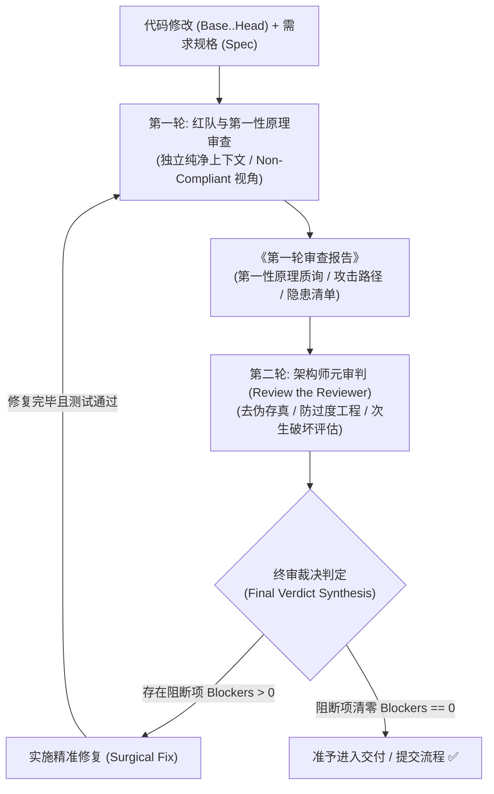

# 双轮对抗审查技能 (Dual-Round Adversarial Review)

## 概述 (Overview)

大模型编程面临三大核心陷阱：**“讨好型盲从（Sycophancy）”**、**“浅层打布丁（Palliative Patching）”** 以及 **“审查幻觉与过度工程（Over-engineering）”**。

本技能通过**辩证双轮级联对抗审查机制**，在代码交付入库前构建一道高置信度的质量防波堤：
* **第一轮 (Round 1)**：极度苛刻的红队破坏者与底层物理/业务本质探究者（Non-Compliant 视角），专攻第一性原理穿透与极限破坏。
* **第二轮 (Round 2)**：务实严谨的资深系统架构师——**专门审判第一轮审查者（Review the Reviewer）**，去伪存真、拦截过度工程，合成终审定性裁决。



---

## 适用场景 (When to Use)

### 必须触发 (Mandatory)
* **核心架构改动**：涉及全局数据流、状态机、多模块契约或跨域架构调整。
* **关键业务逻辑实现**：鉴权鉴权、支付交易、并发调度、复杂算法等核心主干链路。
* **高风险缺陷修复**：排查并修复隐蔽并发死锁、内存/句柄泄漏、以及多次尝试未解的问题。
* **交付与合并准入 (Pre-Merge Gate)**：PR 最终合并或版本发布前。

### 无需触发 (When NOT to Use)
* 纯文案调整、拼写错误修正、无业务逻辑的样式微调。
* 临时探索脚本（Scratch scripts）或投机性 Prototype 原型验证。
* 规则工具（Linter/Prettier/TypeChecker）已经完全覆盖并自动修复的机械约束。

---

## 核心流程规范 (Process Workflow)

作为主调度智能体（Main Agent），请严格按照以下 5 个步骤执行审查：

### 1. 锁定审查基线与规格上下文 (Pin Baseline & Context)
确定审查模式（未提交改动、暂存区或 Commit 区间），并运行辅助脚本提取结构化上下文：
```bash
# 智能模式（优先未提交改动，无改动则检查最近一次 Commit）
bash skills/dual-round-review/scripts/prepare-review-context.sh

# 或指定提交区间
bash skills/dual-round-review/scripts/prepare-review-context.sh [BASE_SHA] [HEAD_SHA]
```
* 确保准备好：① Git Diff 内容与变更统计；② 需求设计或任务描述（Spec）；③ 仓库编码标准。

### 2. 委派第一轮审查：红队与第一性原理 (Dispatch Round 1)
**上下文隔离红线**：分发独立的子智能体，**严禁传入主会话的聊天历史**。使用 [round-1-red-team.md](references/round-1-red-team.md) 提示词模板：
* **调度方式**：
  * *Antigravity 环境*：调用 `invoke_subagent` 工具（`TypeName: "self"` 或 `"research"`，`Role: "Red-Team Auditor"`）。
  * *Claude Code 环境*：使用 `Agent` 工具分发。
  * *命令行环境*：执行 `agy -p '<提示词>'` 或独立会话。
* **角色预设**：极度苛刻、不讲客气（Non-Compliant）、预设代码必定有隐蔽缺陷。
* **审查重点**：
  1. **第一性原理穿透**：是否为浅层修补？是否存在原生极简解法？
  2. **红队对抗压力测试**：构造极限并发竞态、异常注入、资源泄漏、契约破坏路径。
* 🛑 **强制等待红线 (Stop & Await Protocol)**：
  - 调用 `invoke_subagent` 启动 R1 后，主智能体**必须立即停止调用工具并结束当前回复回合**，将执行权交回系统，等待子智能体异步消息唤醒。
  - **严禁在同一回合内抢先输出任何审查预判或假想报告**；
  - 严禁在未收到 R1 真实产出前提前派发 R2。
* 获取子智能体返回的《第一轮对抗审查报告》。

### 3. 委派第二轮审查：元架构师审判 (Dispatch Round 2)
在 **完整收到第一轮审查子智能体的真实输出报告后**，方可分发第二个独立的子智能体，使用 [round-2-meta-architect.md](references/round-2-meta-architect.md) 模板：
* **调度方式**：
  * *Antigravity 环境*：调用 `invoke_subagent`（`Role: "Meta System Architect"`）。
  * *Claude Code 环境*：使用 `Agent` 工具分发。
* **传入内容**：Spec + Git Diff + **第一轮审查报告全文（必须使用 R1 真实返回的内容，严禁主智能体臆造）**。
* **角色预设**：务实严谨的资深系统架构师——**专门审判第一轮审查者（Review the Reviewer）**。
* **审查重点**：
  1. **去伪存真**：排查 R1 是否因缺乏上下文而产生幻觉误报。
  2. **防过度工程 (YAGNI)**：否决 R1 提出的过度抽象、复杂分层或脱离实际的教条化建议。
  3. **次生破坏评估**：评估采纳修复建议是否会诱发更大范围的破坏性重构。
* 🛑 **强制等待红线 (Stop & Await Protocol)**：
  - 调用 `invoke_subagent` 启动 R2 后，主智能体**必须立即停止调用工具并结束当前回复回合**，等待 R2 子智能体完成并返回消息。
  - **严禁在 R2 返回前擅自向用户输出“终审裁决书”**；终审裁决必须基于 R2 架构师的真实裁决结果生成。
* 获取终审输出的《最终裁决明细表》。

### 4. 裁决分流与定性处理 (Verdict Triage)
严格对照 [verdict-rubric.md](references/verdict-rubric.md) 判定结论：
* 🔴 **阻断项 (Blockers, P0/P1)**：
  * **结论**：审查不通过。
  * **状态机锁死**：任务状态强制维持“进行中/未通过”，**严禁在修改代码后自行宣布通过**。
  * **动作**：立即实施精准根因修复（Surgical Fix），**绝不顺手修改无关代码**。修复后运行全量测试确认通过并执行原子提交。
  * **强制再循环 (Mandatory Re-Loop)**：**必须从第 2 步（Round 1）重新启动双轮闭环审查**，将该修复提交作为新审查基线输入。再循环审查时，优先复核阻断项修复补丁是否引入次生回归或契约破坏，防止基线漂移导致循环发散。
* 🟡 **优化建议 (Suggestions, P2/P3)**：
  * **结论**：准予放行。
  * **动作**：记入项目待办或后续优化清单，不阻断本次交付。
* ⚪ **驳回项 (Dismissed)**：
  * **动作**：直接丢弃，无需任何代码修改。

### 5. 防死锁收敛机制 (Convergence Guardrails)
* **精准收敛原则**：修改阻断项时，严格收敛修改范围，防止因顺带重构引入新变量导致审查循环发散。
* **困境突破法则 (The 3-Tries Rule)**：若针对同一模块连续 **3 次** 双轮循环未能清零阻断项，或 R1/R2 陷入无法调和的哲学争议：
  1. 立即停止自动循环。
  2. 整理《双轮审查争议焦点报告》（含分歧代码、两轮观点与潜在风险）。
  3. 升级交由人类工程师（用户）进行最终裁决。

---

## 常见借口与反模式排查 (Rationalizations & Pitfalls)

| 典型借口 / 侥幸心理 | 现实危害与应对规程 |
|:---|:---|
| “改动只有几行，不需要跑双轮” | 多数灾难性死锁或内存泄漏恰恰来自 1-2 行未捕获的异步状态变更。越短的代码越要看是否属于“浅层创可贴”。 |
| “第一轮提的意见很多，我都照着改” | **严禁照单全收！** R1 容易出现脱离实际的过度工程建议，必须经由 R2 架构师元审判过滤伪需求。 |
| “我自己在主会话里把两轮想一遍就行了” | 单一上下文存在不可避免的**自我确认偏差**与讨好倾向。必须通过子智能体实现上下文隔离。 |
| “修复了一个阻断项，只复核第二轮就行” | 修复补丁可能引入新的次生缺陷，必须从第一轮红队攻击重新走完整双轮闭环。 |
| “按架构师意见改完且单测全绿了，不需要再走双轮了” | **⛔ 严重违规（自验偏差与次生缺陷盲区）**！修复代码本身极易引入更致命的次生灾难（如数据清空、状态死锁）。单测全绿绝不能替代外部双轮对抗，必须将修复提交作为输入重新委派 R1 启动再循环。 |
| “发起子智能体后，我顺便把裁决写出来给用户看” | **⛔ 严重违规（虚假抢答）**！子智能体尚未真实推演完毕，主智能体擅自脑补输出会导致审查流于形式甚至掩盖真正缺陷。启动子智能体后必须立即结束回合等待。 |
| “把两轮审查子智能体同时并行启动” | **⛔ 违背级联第一性原理**！R2 的本质使命是审判 R1（Review the Reviewer），没有 R1 的完整输出，R2 根本无从审判，严禁并行发起。 |

---

## 参考文档与实战案例导航

### 规程与提示词参考
* [verdict-rubric.md](references/verdict-rubric.md) - 裁决分级标准与严重级别判定细则
* [failure-modes-catalog.md](references/failure-modes-catalog.md) - 大模型代码生成与审查高频失败模式库
* [round-1-red-team.md](references/round-1-red-team.md) - 第一轮红队与第一性原理子智能体任务模板
* [round-2-meta-architect.md](references/round-2-meta-architect.md) - 第二轮元审判资深架构师子智能体任务模板

### 实战演练案例
* [case-1-palliative-patch.md](examples/case-1-palliative-patch.md) - 案例 1: 浅层修补（打布丁）识别与阻断
* [case-2-over-engineering.md](examples/case-2-over-engineering.md) - 案例 2: 过度工程与纸上谈兵甄别（驳回项）
* [case-3-concurrency-race.md](examples/case-3-concurrency-race.md) - 案例 3: 隐蔽异步竞态与资源泄漏识别（坐实阻断项）
* [case-4-clean-pass.md](examples/case-4-clean-pass.md) - 案例 4: 第一性原理合规实现（阻断项清零，准予交付）

