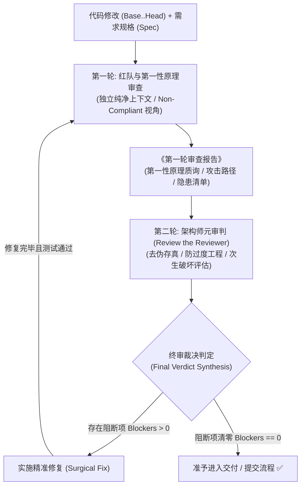

# 双轮对抗审查技能 (Dual-Round Adversarial Review)

## 概述 (Overview)

大模型编程面临三大核心陷阱：**“讨好型盲从（Sycophancy）”**、**“浅层打布丁（Palliative Patching）”** 以及 **“审查幻觉与过度工程（Over-engineering）”**。

本技能通过**辩证双轮级联对抗审查机制**，在代码交付入库前构建一道高置信度的质量防波堤：
* **第一轮 (Round 1)**：极度苛刻的红队破坏者与底层物理/业务本质探究者（Non-Compliant 视角），专攻第一性原理穿透与极限破坏。
* **第二轮 (Round 2)**：务实严谨的资深系统架构师——**专门审判第一轮审查者（Review the Reviewer）**，去伪存真、拦截过度工程，合成终审定性裁决。


```mermaid
graph TD
    Code["代码修改 (Base..Head) + 需求规格 (Spec)"] --> R1["第一轮: 红队与第一性原理审查<br>(独立纯净上下文 / Non-Compliant 视角)"]
    R1 --> R1Out["《第一轮审查报告》<br>(第一性原理质询 / 攻击路径 / 隐患清单)"]
    R1Out --> R2["第二轮: 架构师元审判 (Review the Reviewer)<br>(去伪存真 / 防过度工程 / 次生破坏评估)"]
    R2 --> Verdict{"终审裁决判定<br>(Final Verdict Synthesis)"}
    Verdict -->|存在阻断项 Blockers > 0| Fix["实施精准修复 (Surgical Fix)"]
    Fix -->|修复完毕且测试通过| R1
    Verdict -->|阻断项清零 Blockers == 0| Pass["准予进入交付 / 提交流程 ✅"]
```

---

## 铁律 (Invariants)

1. **上下文隔离**：R1、R2 各自在独立子智能体中运行，只接收 Spec、Diff 与（R2 额外）R1 报告；主会话聊天历史不传入。
2. **真实产出优先**：主智能体在子智能体真实返回前不输出任何审查结论；终审裁决只根据 R2 的真实结果生成。
3. **范围锁定**：候选缺陷必须标注是否由当前变更引入；历史技术债记入 Suggestion/Backlog。
4. **证据支撑**：驳回或降级 R1 的评级必须附 `文件:行` 级反证据；无证据的降级不生效。
5. **三层落盘（状态 + 凭据 + 通道登记）**：每轮结论写入 `.review-context/review-<baseline-sha>.md`（运行时状态，已 gitignore）供再循环读取 `Previous Blockers` 与迭代计数；**《审查报告全文》必须逐字归档**至 `<归档根>/<YYYY-MM-DD>-<slug>/`（交付凭据，进版本库，见步骤 1.6），**默认由子智能体在路径预授权下直写**；轮次台账必须登记**写入形态**（`direct` / `transcribed`）。**严禁以摘要替代报告全文归档，严禁以「子智能体已写成功」替代独立指纹复算**。
6. **有界收敛**：同一模块连续 3 次双轮循环未清零阻断项时，产出争议焦点报告并升级人类裁决；修复收敛在最小改动范围。
7. **派发即登记**：派发 R1/R2 前在 `.goal-loop/dispatch-ledger.md` 维护派发账本明细（角色、后端句柄、基线 SHA、**派发次数**、状态），并在计划检查点保留一行派生摘要。预算内未返回即按 `goal-loop` 技能的 `references/host-adapters.md` §5 收口；**同一角色对同一基线的重派上限 2 次**，超期中断计入铁律 6 的循环计数。跨会话恢复时先读账本明细，明细已丢失则以计划摘要为锚点，禁止凭记忆重建派发状态。

---

## 审查模式 (Review Modes)

| 模式 | 轮次 | 适用场景 | 产出 |
|---|---|---|---|
| **Full（默认）** | R1 红队 → R2 元审判 | Heavy Track / 核心架构 / 关键业务链路 / Pre-Merge | 终审裁决明细表 |
| **Light（单轮）** | 仅 R1 红队 + 轻量裁决 | Fast-Track / 局部定向改动 / 未触及公共契约与核心链路 | R1 报告 + 轻量裁决表 |
| **Delta（再循环）** | Full 或 Light 的再循环 | 阻断项修复后，以修复提交为新基线 | 更新后的审查记录与终审 |

**Light Mode 规程**：
1. 仅派发 R1（使用 [round-1-red-team.md](references/round-1-red-team.md) 模板，`Review Mode: LIGHT_REVIEW`）；
2. 主智能体对照 [verdict-rubric.md](references/verdict-rubric.md) 直接裁决，输出裁决明细表（复用 §4 的 7 列结构，"原始 R1 评级"与"终审裁决"由同一裁决者填写）；
3. 阻断项修复后按 Delta 再循环；**升级为 Full 的触发条件**：改动触及公共契约、核心业务链路、鉴权/并发/数据一致性，或即将合并 PR/发布；
4. Light 的豁免依据与升级决定写入审查记录（步骤 1.5）；若由 `goal-loop` 驱动，同步写入其计划检查点。

---

## 适用场景 (When to Use)

### 必须触发 (Mandatory)
* **核心架构改动**：涉及全局数据流、状态机、多模块契约或跨域架构调整。
* **关键业务逻辑实现**：鉴权与授权、支付交易、并发调度、复杂算法等核心主干链路。
* **高风险缺陷修复**：排查并修复隐蔽并发死锁、内存/句柄泄漏、以及多次尝试未解的问题。
* **交付与合并准入 (Pre-Merge Gate)**：PR 最终合并或版本发布前。

### 无需触发 (When NOT to Use)
* 纯文案调整、拼写错误修正、无业务逻辑的样式微调。
* 临时探索脚本（Scratch scripts）或投机性 Prototype 原型验证。
* 规则工具（Linter/Prettier/TypeChecker）已经完全覆盖并自动修复的机械约束。

---

## 核心流程规范 (Process Workflow)

作为主调度智能体（Main Agent），请严格按照以下 5 个步骤执行审查：

### 1. 锁定审查基线与规格上下文 (Pin Baseline & Context)
确定审查模式（未提交改动、暂存区或 Commit 区间），并运行辅助脚本提取结构化上下文：
```bash
# 技能目录随安装方式而定（源码仓库通常为 skills/dual-round-review，安装后通常为 .agents/skills/dual-round-review）
SKILL_DIR="<dual-round-review 技能实际所在目录>"

# 智能模式（优先未提交改动，无改动则检查最近一次 Commit）+ 启用交付凭据归档 scaffold（RFC-0001）
bash "$SKILL_DIR/scripts/prepare-review-context.sh" --slug=<交付单元slug>

# 或指定提交区间（归档根可用 --archive-root=<路径> 覆盖，默认 docs/project/reviews）
bash "$SKILL_DIR/scripts/prepare-review-context.sh" --slug=<交付单元slug> [BASE_SHA] [HEAD_SHA]
```
* 确保准备好：① Git Diff 内容与变更统计；② 需求设计或任务描述（Spec）；③ 仓库编码标准；④ **（条件）前端产物交付时：`frontend-qa-gate`《前端验收报告》的结论必须为 PASS（以 `check-qa-report.sh --require-verdict=PASS --min-assertions=15` 机械校验为准）；FAIL / BLOCKED（含未验证项）时先按该技能回流路由处理，不得进入审查放行。**

### 1.5 审查记录锚点 (Review Record Anchor)
审查循环的短周期状态必须落盘，避免上下文截断后丢失 `Previous Blockers` 与迭代计数。每个基线创建一个记录文件 `.review-context/review-<baseline-sha>.md`（该目录已在 `.gitignore` 中忽略），schema 固定如下：

```markdown
# 审查记录 · <baseline-sha>
- **模式**: [full | light | delta]
- **基线**: <BASE_SHA>..<HEAD_SHA>
- **轮次**: [1 | 2 | ...]
- **迭代计数**: [n/3]
- **Previous Blockers**: [上一轮坐实的 Blocker 稳定 ID 列表，或 无]
- **Round 1 结论**: [报告摘要或报告文件路径]
- **终审裁决**: [🔴 阻断交付 | ✅ 准予交付 | 未定]
- **阻断项统计**: [🔴 X / 🟡 Y / ⚪ Z]
```

**恢复规则**：进入审查前若已存在同基线记录，先读取该文件恢复轮次、`Previous Blockers` 与迭代计数，再决定继续、再循环或升级。记录文件由 `prepare-review-context.sh` 生成，或按上述 schema 手工创建。若锚点含「归档索引」段，**同时**从该归档根读取 `README.md` 轮次台账，恢复上一轮报告文件路径与其 SHA256 指纹（Delta 再循环据此核验报告未被改写）。

### 1.6 交付凭据归档 (Review Evidence Archive)
审查报告全文是**不可重建**的交付凭据：会话一旦结束，子智能体的推理链、攻击路径推演与 `文件:行` 反证据即永久消失（本仓库曾出现归档摘要自述「全文见会话记录」）。因此必须与运行时锚点**分层落盘**：

| 层 | 位置 | 生命周期 | 进版本库 |
|:---|:---|:---|:---:|
| ① 运行时状态 | `.review-context/review-<baseline-sha>.md` | 一次审查循环 | ❌（已 gitignore，正确设计） |
| ② 交付凭据 | `<归档根>/<YYYY-MM-DD>-<slug>/` | 交付审计期 | ✅ |
| ③ 机械门禁 | `scripts/check-review-report.sh` | — | ✅ |

* **归档根**：推荐默认 `docs/project/reviews/`；宿主项目若已有既定的审查记录规范（既有 `reviews/` 目录或 doc-governance 变体）**以宿主规范为准**，并把实际归档根登记至锚点「归档索引」段。
* **命名规范**：一个交付单元一个目录（Delta 再循环各轮共享，目录名日期取**首次审查日**）；轮次文件为 `<轮次标记>-<base7>..<head7>.md`，轮次标记取 `r1` / `r2` / `delta-r1` / `delta-r2`。目标路径由 `prepare-review-context.sh --slug=<slug> --round=<轮次>` **机械化产出**（见步骤 2「派发前预授权」），**禁止手工拼装**。
* **归档索引** `README.md` 的轮次台账 schema：`| 轮次 | 基线 | 派发句柄 | 报告文件 | SHA256(前 12 位) | 结论 | 写入形态 |`。**「写入形态」列取值只能为 `direct` 或 `transcribed`**，它是唯一能区分「子智能体直写原文」与「主智能体转录产物」的可审计属性（RFC-0002 §3.4）。
* **写入通道与路径预授权（V2.2.0）**：
  * **直写通道（默认）**：R1/R2 子智能体的 `Write-Scope` 约束为其开**唯一例外**——**作者本人**将报告原文写入主智能体预授权的目标路径。主智能体**不再经手内容**，改为**独立复算 SHA256 全值**（`sha256sum <报告文件>`）并与子智能体回报的**全值**逐字比对（**R1-4 回归**：两侧口径必须同为 64 位——模板回报全值、核验复算全值；仅**登记台账**时才取前 12 位），一致方可登记。
  * **转录降级**：子智能体无写盘能力或写入失败时，由主智能体逐字转录写盘，**必须在台账登记 `transcribed`**。**静默降级违规**。**降级原因须写入版本库载体（R1-10 回归）**——在归档索引 `README.md` 的留痕区（`[!WARNING]` / `[!NOTE]` 块）显式记录降级事实、原因与受影响轮次；**严禁**只写进 `.review-context/` 锚点（该目录已 gitignore，clone 即失），**严禁**把原因文本拼进「写入形态」单元格（第 8 项按等值校验，拼接即判非法）。
  * **路径预授权六条**：① 路径由主智能体在派发前确定并以**字面值**内联提示词，子智能体**不得自选/推断/改写**；② **路径必须是基线的确定函数**——`--round` 与自适应模式（自动判定 working/range）**互斥**，必须显式给出 `BASE_SHA [HEAD_SHA]` 或 `--working`/`--staged`；否则同一命令两次调用会因工作区被 scaffold 自身弄脏而输出不同文件名，Write-Once 保护静默失效、产生门禁不可枚举的孤儿报告（**R1-1 回归**）；③ 归档目录须已 scaffold，子智能体**不得创建目录**；④ 目标文件**不得预创建**；⑤ **Write-Once**——已存在即中止，严禁覆盖；⑥ 该路径是子智能体**唯一**被授权的写入面，索引 `README.md`、锚点、`.gitignore`、任何源码一律禁写。
  * **诚实边界（不得省略）**：路径预授权是**提示词契约**。本技能为宿主无关的分发资产，不掌握宿主沙箱，故其约束强度等同于宿主的实际能力——**严禁**在文档或汇报中表述为「已隔离」。直写通道消除的是**转录失真**；`transcribed` 形态下的转录改写残差仍在，且 `direct` 形态的声明本身**不可机械验证**（RFC-0002 §3.3 / §3.5）。
* **门禁**：归档完成后运行 `bash "$SKILL_DIR/scripts/check-review-report.sh" <归档目录>`；交付放行场景追加 `--require-verdict=PASS`。校验项：索引字段齐备 / 报告在位非空 / 指纹一致 / R1 五区块 / R2 三区块 / 稳定 ID 两轮对齐 / 围栏剥离后仍齐备 / **写入形态合法（`direct` 或 `transcribed`）**。
* **V2.1.0 → V2.2.0 迁移**：既有归档的轮次台账须**一次性补「写入形态」列**，历史轮次一律填 `transcribed`（V2.1.0 只有转录通道）；**只改索引台账，报告文件与 SHA256 指纹不得变动**。未补列（或该值退回缺失）的旧台账会被门禁判失败（第 8 项）。
  * **机制如实说明（R1-3 回归）**：第 8 项按**行内第 7 个数据单元格**取值校验——**缺失即失败、取值非 `direct`/`transcribed` 即失败**，它**不解析表头**。因此「删掉表头的『写入形态』单元格」本身不豁免校验（值仍在即通过），但这**不等于**门禁在强制 schema 一致性——本技能**刻意不**为此新增表头解析（新增解析耦合属过度工程）。
* **异常降级**：
  1. 落盘失败（权限、磁盘）→ 按 `goal-loop` 的 `references/host-adapters.md` §5 收口并记录中断原因；**严禁在无归档的情况下宣布审查通过**；
  2. 宿主无 `docs/` 结构 → 按「宿主优先」原则选定归档根并登记至锚点；
  3. Delta 再循环同名文件冲突 → 视为基线漂移缺陷，**不得覆盖**既有报告；
  4. **子智能体不可写（无能力 / 写入失败）** → 走转录降级，台账登记 `transcribed`，锚点记录降级原因；**严禁**为规避降级而更换目标路径、创建目录或覆盖既有文件；
  5. **指纹复算不一致 或 目标文件缺失** → 判定为写入异常，**不得登记台账**，按 `goal-loop` 的 `references/host-adapters.md` §5 收口；
  6. **子智能体返回了报告文本但未写盘** → 先确认是否能力缺失；确认后方可降级，**严禁**默认转录并按 `direct` 登记；
  7. **同轮同基线需重派（报告不合格）** → 确定性命名 + Write-Once 组合下**没有就地恢复路径**（目标文件已存在且不可覆盖）。合法处置：**作废该轮**——将不合格报告移出归档目录留痕（如 `.review-context/`，已 gitignore），**不登记台账**，再以**同一轮次标记与同一基线**重派（重写同一路径）。若重派仍不合格，按铁律 7「同一角色对同一基线的重派上限 2 次」收口并升级人类裁决。**严禁**覆盖、**严禁**改用其他路径规避、**严禁**把不合格报告登记进台账。

### 2. 委派第一轮审查：红队与第一性原理 (Dispatch Round 1)
**上下文隔离红线**：分发独立的子智能体，**严禁传入主会话的聊天历史**。使用 [round-1-red-team.md](references/round-1-red-team.md) 提示词模板：
* **派发能力（宿主无关）**：使用当前宿主实际的子智能体派发能力，按能力语义选择，不绑定具体工具名或平台（以本会话声明的工具为准）。
* **派发模式判定**：
  * **同步派发**（调用即在本次返回结果）：在当前回合直接取回 R1 报告后继续步骤 3；
  * **异步派发**（先返回句柄、稍后以消息唤醒）：启动后结束当前回合等待唤醒，收到真实报告后再继续；
  * 判定依据是工具的返回语义，而不是平台名称。
* **角色预设**：极度苛刻、不讲客气（Non-Compliant）、预设代码必定有隐蔽缺陷。
* **审查重点**：
  1. **Diff 范围边界锁 (Diff-Scope Boundary Lock)**：完整规则见 [verdict-rubric.md](references/verdict-rubric.md) §3；派发给 R1 的提示词中必须内联该规则（子智能体上下文隔离，无法自行读取本文件）。
  2. **第一性原理穿透**：是否为浅层修补？是否存在原生极简解法？
  3. **运行时现实维度（条件激活）**：仅当 diff 触及客户端/SSR 代码时激活（判定条件与细则见 [round-1-red-team.md](references/round-1-red-team.md) 的条件维度块）；非前端改动跳过该维度。
  4. **红队对抗压力测试**：构造极限并发竞态、异常注入、资源泄漏、契约破坏路径。
  5. **定向再循环核验 (Delta Re-Loop)**：若属于 Blocker 修复后的再循环，重点审计上一轮 Blocker 是否被根治，以及修复补丁本身是否引入次生缺陷。
* **真实产出纪律**：在 R1 真实报告返回前，不输出任何审查预判或假想报告，也不提前派发 R2；异步派发时结束回合并等待唤醒。
* **派发预算 (Dispatch Budget)**：R1 的等待预算为 **1 个检查点周期**。超期未返回即判定为超期事件，按 `goal-loop` 技能的 `references/host-adapters.md` §5 收口（中断 → 落盘记录 `.review-context/review-<baseline-sha>.md` → 替代路径 → 更新派发账本），**严禁无限期等待**。中断并如实记录不违反真实产出纪律；用空报告冒充审查结论才是违规。
* **派发前预授权**：运行 `bash "$SKILL_DIR/scripts/prepare-review-context.sh" --slug=<slug> --round=r1 <BASE_SHA> [HEAD_SHA]`（**必须显式给出基线**，或显式用 `--working`/`--staged`；`--round` 与自适应模式互斥——否则路径会因工作区被 scaffold 自污染而漂移，见 §1.6 路径预授权第 ② 条），从输出取「**本轮报告目标路径**」，将其**字面值内联**至派发提示词的 `[REPORT_PATH]` 槽位。目标文件已存在时脚本会给出 Write-Once 告警——**先排查命名冲突**（基线漂移缺陷）再派发。**禁止**由子智能体自选路径。
* **收到回报后核验与登记**：拿到 R1 返回后依次完成 ① **核验写入结果**——文件确实存在于预授权路径、字节数一致，并**独立复算 SHA256 全值** `sha256sum <报告文件>` 与子智能体回报的**全值**比对（两侧同为 64 位，见 §1.6 直写通道的 R1-4 口径；不一致或缺失 → 按 §1.6 异常降级第 5 条收口，**不得登记**）；② 写入 `.review-context/review-<baseline-sha>.md` 的 Round 1 字段（见步骤 1.5）；③ 在归档索引轮次台账登记基线、派发句柄、文件名、SHA256 前 12 位、结论与**写入形态**（直写填 `direct`；转录降级填 `transcribed` 并记录原因）；④ 运行 `check-review-report.sh` 确认结构可校验。**归档与登记完成后方可进入步骤 3**。
* 获取子智能体返回的《第一轮对抗审查报告》。

### 3. 委派第二轮审查：元架构师审判 (Dispatch Round 2)
在 **完整收到第一轮审查子智能体的真实输出报告后**，方可分发第二个独立的子智能体，使用 [round-2-meta-architect.md](references/round-2-meta-architect.md) 模板：
* **派发能力与模式**：沿用步骤 2 的宿主无关派发规则与同步/异步判定（同步则本回合取回，异步则结束回合等唤醒）。
* **传入内容**：Spec + Git Diff + **第一轮审查报告全文（必须使用 R1 真实返回的内容，严禁主智能体臆造）**。
* **角色预设**：务实严谨的资深系统架构师——**专门审判第一轮审查者（Review the Reviewer）**。
* **审查重点**：
  1. **边界越界拦截 (Boundary Enforcement)**：核实 R1 的候选 Blocker 是否由当前变更引入；历史技术债降级为 Suggestion/Dismissed（规则见 [verdict-rubric.md](references/verdict-rubric.md) §3）。
  2. **去伪存真**：排查 R1 是否因缺乏上下文而产生幻觉误报。
  3. **防过度工程 (YAGNI)**：否决 R1 提出的过度抽象、复杂分层或脱离实际的教条化建议。
  4. **次生破坏评估**：评估采纳修复建议是否会诱发更大范围的破坏性重构。
  5. **批量降级红旗**：R2 将 R1 的多个 P0/P1 一次性降级或驳回时，必须逐条给出 `文件:行` 级反证据；主智能体抽检，证据不足者退回 R2 重审。
* **真实产出纪律**：在 R2 真实裁决返回前，不输出“终审裁决书”；终审裁决必须基于 R2 的真实结果生成（异步派发时结束回合等待唤醒）。
* **派发预算**：同 R1（等待预算 1 个检查点周期）；超期按 `goal-loop` 技能的 `references/host-adapters.md` §5 收口并落盘。
* **派发前预授权**：以 `--round=r2`（Delta 再循环用 `delta-r2`）**并显式给出同一基线**重新取目标路径并内联至 `[REPORT_PATH]`。
* **收到回报后核验与登记**：拿到 R2 裁决后依次完成 ① **核验写入结果**（同步骤 2 的独立复算与存在性检查）；② 写入 `.review-context/review-<baseline-sha>.md` 的终审字段（见步骤 1.5）；③ 登记轮次台账并填**写入形态**；④ 运行 `check-review-report.sh --require-verdict=PASS` 确认放行结论可机械校验。**归档与登记完成后方可进入步骤 4**。
* 获取终审输出的《最终裁决明细表》。

### 4. 裁决分流与定性处理 (Verdict Triage)
严格对照 [verdict-rubric.md](references/verdict-rubric.md) 判定结论：
* 🔴 **阻断项 (Blockers, P0/P1)**：
  * **结论**：审查不通过。
  * **状态机锁死**：任务状态强制维持“进行中/未通过”，**严禁在修改代码后自行宣布通过**。
  * **动作**：立即实施精准根因修复（Surgical Fix），**绝不顺手修改无关代码**。修复后运行全量测试确认通过并执行原子提交。
  * **定向再循环规程 (Delta Re-Loop Protocol)**：以修复提交为新基线，并在提示词中传入 `Previous Blockers`（稳定 ID 列表）。
    - **Full-Delta**：从第 2 步重新派发 R1 → R2 完整闭环；R1 聚焦 Blocker 修复证据与直接次生退化，R2 终审放行；
    - **Light-Delta**：仅重新派发 R1 并按 Light 规程重新裁决（无 R2），适用于 Light 模式命中 Blocker 的修复后；
    - 两者都从审查记录读取迭代计数，防止基线漂移与发散。
* 🟡 **优化建议 (Suggestions, P2/P3)**：
  * **结论**：准予放行。
  * **动作**：记入项目待办或后续优化清单，不阻断本次交付。
* ⚪ **驳回项 (Dismissed)**：
  * **动作**：直接丢弃，无需任何代码修改。

### 5. 防死锁收敛机制 (Convergence Guardrails)
* **精准收敛原则**：修改阻断项时，严格收敛修改范围，防止因顺带重构引入新变量导致审查循环发散。
* **困境突破法则 (The 3-Tries Rule)**：若针对同一模块连续 **3 次** 双轮循环未能清零阻断项，或 R1/R2 陷入无法调和的哲学争议：
  1. 立即停止自动循环。
  2. 整理《双轮审查争议焦点报告》（含分歧代码、两轮观点与潜在风险）。
  3. 升级交由人类工程师（用户）进行最终裁决。

---

## 常见借口与反模式排查 (Rationalizations & Pitfalls)

| 典型借口 / 侥幸心理 | 现实危害与应对规程 |
|:---|:---|
| “改动只有几行，不需要跑双轮” | 多数灾难性死锁或内存泄漏恰恰来自 1-2 行未捕获的异步状态变更。越短的代码越要看是否属于“浅层创可贴”。 |
| “第一轮提的意见很多，我都照着改” | **严禁照单全收！** R1 容易出现脱离实际的过度工程建议，必须经由 R2 架构师元审判过滤伪需求。 |
| “R1 挑出了很多历史遗留问题，统统作为 Blocker 修复” | **⛔ 严重违规（审查范围蔓延与历史越界）**！非本次变更引入的历史技术债按 [verdict-rubric.md](references/verdict-rubric.md) §3 降级为 Suggestion 记入待办，否则 PR 无法收敛并引入次生回归。 |
| “jsdom 单测全绿了，不会有运行时问题”（仅前端/SSR 项目） | **⛔ 忽视真实运行环境**！jsdom 不会检查 Next.js SSR 水合分歧、Safari 无痕模式下的 `SecurityError` 或条件早退调用 Hook 导致的生产构建/运行时崩溃。必须执行专项检查。 |
| “我自己在主会话里把两轮想一遍就行了” | 单一上下文存在不可避免的**自我确认偏差**与讨好倾向。必须通过子智能体实现上下文隔离。 |
| “修复了一个阻断项，只复核第二轮就行” | 修复补丁可能引入新的次生缺陷，必须重跑 R1；Full 模式还须重跑 R2 完成闭环。 |
| “按架构师意见改完且单测全绿了，不需要再走双轮了” | **⛔ 严重违规（自验偏差与次生缺陷盲区）**！修复代码本身极易引入更致命的次生灾难（如数据清空、状态死锁）。单测全绿绝不能替代外部双轮对抗，必须将修复提交作为输入重新委派 R1 启动再循环。 |
| “发起子智能体后，我顺便把裁决写出来给用户看” | **⛔ 严重违规（虚假抢答）**！子智能体尚未真实推演完毕，主智能体擅自脑补输出会导致审查流于形式甚至掩盖真正缺陷。异步派发时结束回合等待；同步派发时也在本次调用返回报告后再输出结论。 |
| “把两轮审查子智能体同时并行启动” | **⛔ 违背级联第一性原理**！R2 的本质使命是审判 R1（Review the Reviewer），没有 R1 的完整输出，R2 根本无从审判，严禁并行发起。 |
| “报告摘要已经写进锚点了，就等于归档了” | **⛔ 严重违规（凭据灭失）**！摘要只有结论统计，R1 的攻击路径推演、`文件:行` 证据与 R2 的反证据链全部留在会话里，会话一结束即永久消失。**严禁以摘要替代报告全文归档**：必须把子智能体返回的原文逐字写入 `<归档根>/<date>-<slug>/` 并登记 SHA256 指纹（见步骤 1.6）。 |
| “R1 迟迟不返回，我先把 R2 派出去并行推进”“既然 R2 拿不到 R1 报告，我就把它的独立意见当作终审” | **⛔ 违规（并发规避 + 空报告冒充）**！前者违反级联顺序，后者把“无输入的独立核查”偷换为“双轮对抗结论”。正确处置：按派发预算收口该子智能体——中断 → 落盘记录中断原因 → 选择替代路径（原后端重派收窄范围 / 切换至隔离后端；**审查类无法保证隔离时必须升级人类裁决——内联自审不构成任何一轮审查**）→ 更新派发账本（**执行类派发另有内联例外，见 `goal-loop` 技能的 `references/host-adapters.md` §5.4(d)**，但其结果不得用于任何审查轮次）；R2 必须接收 R1 的**真实报告全文**后方可派发。 |
| “子智能体回报说写成功了，我直接登记 `direct`” | **⛔ 严重违规（跳过核验）**！回报是子智能体的**自述**，不是证据。必须**独立复算** SHA256 并与回报值比对，同时确认文件确实存在于预授权路径；不一致或缺失按 §1.6 异常降级第 5 条收口，**不得登记**。 |
| “报告没落盘，我替它写一份，照样登记 `direct`” | **⛔ 严重违规（虚假登记）**！转录就登记 `transcribed`。把转录产物登记为 `direct` 会让「写入形态」列失去全部审计价值——该列存在的意义正是**暴露降级**，而不是掩盖它。 |
| “路径预授权只是提示词，宿主又不强制，写哪儿都行” | **⛔ 违规（越界写入）**！预授权路径是子智能体**唯一**被授权的写入面。在无沙箱强制的宿主上约束强度确实等同于自律——**正因如此**，编排者必须在派发时给出唯一字面路径、在回报核验中确认落位，并在有 CI/门禁能力时于门禁侧兜底；「宿主不强制」是必须被登记的**已知边界**，不是放行越界写入的理由。 |

---

## 参考文档与实战案例导航

### 规程与提示词参考
* [verdict-rubric.md](references/verdict-rubric.md) - 裁决分级标准与严重级别判定细则
* [failure-modes-catalog.md](references/failure-modes-catalog.md) - 大模型代码生成与审查高频失败模式库
* [round-1-red-team.md](references/round-1-red-team.md) - 第一轮红队与第一性原理子智能体任务模板
* [round-2-meta-architect.md](references/round-2-meta-architect.md) - 第二轮元审判资深架构师子智能体任务模板
* [check-review-report.sh](scripts/check-review-report.sh) - 《交付凭据归档》结构机械门禁（索引字段 / 指纹一致 / 两轮区块 / 稳定 ID 对齐 / **写入形态合法**；`--require-verdict=PASS` 供交付放行）
* [prepare-review-context.sh](scripts/prepare-review-context.sh) - 审查上下文提取与归档 scaffold（`--slug` + `--round` 产出**预授权报告目标路径**，供派发提示词内联）

### 实战演练案例
* [case-1-palliative-patch.md](examples/case-1-palliative-patch.md) - 案例 1: 浅层修补（打布丁）识别与阻断
* [case-2-over-engineering.md](examples/case-2-over-engineering.md) - 案例 2: 过度工程与纸上谈兵甄别（驳回项）
* [case-3-concurrency-race.md](examples/case-3-concurrency-race.md) - 案例 3: 隐蔽异步竞态与资源泄漏识别（坐实阻断项）
* [case-4-clean-pass.md](examples/case-4-clean-pass.md) - 案例 4: 第一性原理合规实现（阻断项清零，准予交付）


