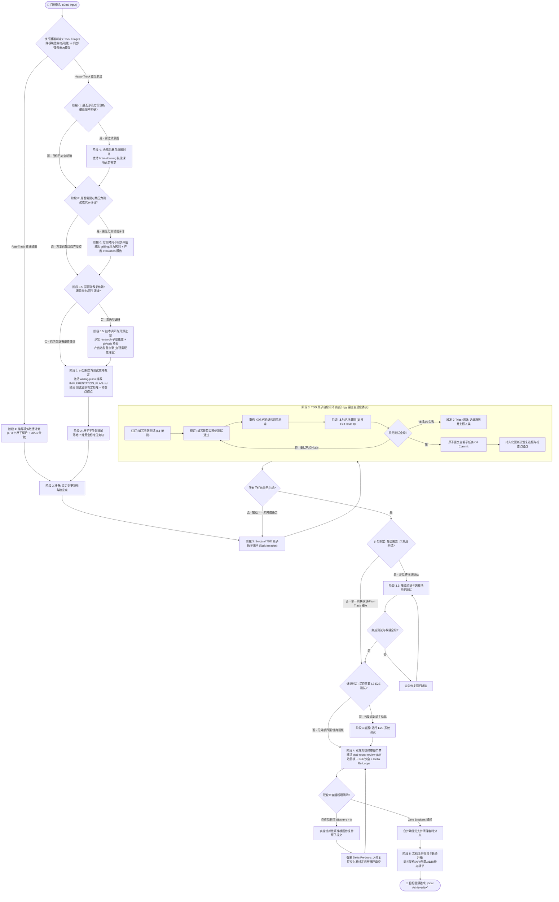

# `goal-loop` 目标实现循环技能规程 (Goal Realization Loop)

## 概述 (Overview)

`goal-loop` 是专为大语言模型（LLM）长程、跨模块研发任务设计的**自愈闭环状态机工作流**。
它融合了 **Ralph Loop 磁盘记忆持久化思维**、**Manus AI 上下文工程** 与 **faceFusionCpp 工业级 TDD 规程**，通过“主调度智能体长上下文统筹 + 执行子智能体短上下文物理隔离”的现代架构，深度串联全生命周期技能：
* **阶段 -1 (意图对齐)** ➔ `brainstorming`
* **阶段 0 (方案拷问)** ➔ `grilling` (`/grill-me`)
* **阶段 0.5 (开源调研与选型)** ➔ `research` / `find-docs` / `gh` CLI
* **阶段 1 (架构规划与测试定级)** ➔ `writing-plans`
* **阶段 3 (执行委派)** ➔ `agy-delegation-workflow`
* **阶段 4 (终审门禁)** ➔ `dual-round-review`

---

## 适用场景 (When to Use)

### 必须使用
* **长程复合研发任务**：跨越多个文件或模块、耗时预期超过 10 分钟的新特性开发、系统重构或重大 Bug 修复；
* **需要高保真交付与严格测试保护**：杜绝浅层修补（Palliative Patching）或未跑测试就草率交付的任务；
* **易受上下文腐化（Context Rot）困扰的复杂任务**：步骤繁琐、容易遗忘初始目标或需要跨会话断点恢复的场景。

### 豁免场景
* 纯文案微调、单行常量修改、直接的只读问答检索。

---

## 总体架构与双轨状态机拓扑 (State Machine Architecture)



---

## 双轨制执行通道分流法则 (Tiered Execution Tracks)

1. **Heavy Track (重型主航道)**：
   - **适用**：跨越 3 个以上模块、涉及全局数据流、底层数据模型重构、全新复杂业务功能。
   - **执行流**：严格执行 P-1 到 P5 完整 9 阶段，执行全量双轮对抗审查。
2. **Fast-Track (敏捷轻量通道)**：
   - **适用**：单文件或局部微调、已有页面空状态/交互补全、单函数工具封装、定向 Defect 修复。
   - **执行流**：**豁免 P-1（头脑风暴）、P0（方案拷问）、P0.5（开源调研）**，直接以需求为输入在 `IMPLEMENTATION_PLAN.md` 编写轻量计划（阶段 1），进入阶段 3 Surgical TDD，走定向双轮审查（阶段 4），最后归档（阶段 5）。杜绝轻量任务陷入流程空转。

---

## 核心阶段 SOP 与生态技能协同契约

详见 [stage-progression-protocol.md](references/stage-progression-protocol.md)。

### 1. 阶段 -1：头脑风暴与意图对齐 ➔ `brainstorming` (仅 Heavy Track)
* **协同契约**：调用 `brainstorming` 梳理意图，向用户呈现 2~3 个备选方案。
* **硬门禁 (<HARD-GATE>)**：**未获得用户明确点头认可（User Nod）前，严禁动手写代码或编写实施方案！**

### 2. 阶段 0：方案压力测试与技术债评估 ➔ `grilling` (仅 Heavy Track)
* **协同契约**：调用 `grilling` 针对设计假设进行无情拷问，清空设计决策树未决分支；产出现状评估报告（参考 [evaluation-report-template.md](templates/evaluation-report-template.md)）。

### 3. 阶段 0.5：技术调研与开源选型 ➔ `research` / `find-docs` (仅 Heavy Track)
* **协同契约**：派发只读 `research` 子智能体，按照“代码库内排查 ➔ GitHub 社区 (`gh`) ➔ 官方权威文档 (`find-docs` / `web_search`)”逐级展开，产出轻量备忘录（参考 [research-spike-template.md](templates/research-spike-template.md)）。
* **硬门禁 (<HARD-GATE>)**：**优先复用成熟方案；若决定自研，必须在备忘录中提供充分的自研辩护，未完成选型裁决前严禁进入阶段 1 编写计划！**

### 4. 阶段 1：计划制定与测试策略裁定 ➔ `writing-plans`
* **协同契约**：激活 `writing-plans` 技能，在磁盘编写 `IMPLEMENTATION_PLAN.md`（参考 [goal-plan-template.md](templates/goal-plan-template.md)）；
* **自适应测试定级**：依据 [testing-decision-matrix.md](references/testing-decision-matrix.md) 输出《测试策略裁定书》，明确当前任务必须执行的测试级别（L0~L3）与命令；
* **持久化检查点固化**：在计划文件头部必须显式维护 `## 🚀 活跃执行状态与持久化检查点 (Active Checkpoint)` 锚点。

### 5. 阶段 2：原子任务拆解与规约生成 (Heavy Track 必选，Fast-Track 视复杂度内联)
* **拆解原则**：切分为 2~5 分钟的微型子任务（Bite-Sized），每个子任务具备独立测试断言；
* **通用标准**：遵循 [atomic-task-template.md](templates/atomic-task-template.md) 规定的 7 维黄金标准。

### 6. 阶段 3：TDD 循环实现 ➔ `agy-delegation-workflow`
* **宿主自适应**：
  - **Antigravity 原生环境**：前台直接调用原生 `invoke_subagent` 派发子任务，**严禁在终端套娃调用 `agy` 命令行**；
  - **非 agy 终端环境**：使用 `dispatch-agy.sh` 清除代理并注入 `Gemini 3.8 Flash (High)` 无头后台进程。
* **TDD 铁律**：🔴 编写失败单测（L1）➔ 🟢 最简代码使测试通过 ➔ 🔵 保持测试全绿重构 ➔ ✅ 单元测试 Exit Code 0 ➔ 💾 原子提交 Git Commit ➔ 📌 更新检查点锚点。

### 7. 阶段 3.5：集成验证与回归测试
* **触发条件**：测试策略裁定书中包含 **L2 集成测试** 时必须执行；
* **验证标准**：全量集成测试与全局编译构建（如 `pnpm build` / `cargo build`）全绿通过。

### 8. 阶段 4：E2E 验收与双轮对抗终审 ➔ `dual-round-review`
* **E2E 执行**：若涉及用户主干链路，运行 L3 端到端测试；
* **终审硬门禁 (<HARD-GATE>)**：必须调用 `dual-round-review` 技能派发第一轮红队审计（R1）与第二轮资深架构师（R2），**取得针对最新代码提交的 Zero Blockers（阻断项清零）终审裁决报告方可合并入库！**
* **Diff 边界锁与 SSR 安全**：R1 必须锁死在 Diff 范围内部，严禁将历史既有技术债定为 Blocker；重点核查 Rules of Hooks 早退调用与 Storage 沙盒防御；
* **Delta Re-Loop 循环闭环**：若 R2 判定 `Blockers > 0`，实施针对性根因修复并提交后，**严禁自行宣布通过，必须以修复提交为基线激活 Delta Re-Loop 重新派发双轮审查**，直至取得独立子智能体给出的 Zero Blockers 裁决。

### 9. 阶段 5：文档全向归档与联动同步
* **同步规范**：对照 [documentation-sync-matrix.md](references/documentation-sync-matrix.md) 逐项核验并更新架构、API、用户手册、配置与待办清单，将计划更新为 `[已完成]`；
* **未来技能解耦**：本阶段为通用基线层，若当前项目配置了专用文档治理技能，可在此阶段触发其执行。


---

## 上下文工程核心守则 (Context Engineering)

详见 [context-engineering.md](references/context-engineering.md)。

1. **持久化优先**：内存易失有限，磁盘无限持久。任何关键发现与进度必须物理写入磁盘。
2. **核心事实即刻沉淀**：探查捕获到重大架构契约、决策或致命报错时即刻落盘；临时碎片记录在临时 Scratchpad，防止主计划文档膨胀反噬上下文。
3. **防御性调用规范 (Read-Modify-Verify)**：文件写入或局部编辑后，必须通过 `git diff`、精准查看关键变更行或执行编译/测试状态码检查确认变更生效，严禁盲目假设写入成功。进入新阶段主动读取计划，中断恢复读取状态机。

---

## 异常恢复与 3-Tries 熔断协议

详见 [failure-recovery-protocol.md](references/failure-recovery-protocol.md)。

* **3-Tries Rule**：针对任何单一错误连续尝试上限为 **3 次**。
* **第 2 次失败微观排查**：第 2 次修复失败后强制暂停盲改，调用 `gh search issues` 或 `web_search`/`find-docs` 查证已知 Bug 与权威解法。
* **第 3 次熔断升级**：第 3 次失败时立即停止代码修改，生成结构化仲裁报告（`STOP -> RECORD -> RESEARCH -> ESCALATE`），向人类工程师请求决策。

---

## 辅助工具与状态机脚本

工作区可通过轻量脚本跟踪断点状态（维护 `.goal-loop/state.json`）：
```bash
# 初始化目标状态机
bash skills/goal-loop/scripts/goal-state-tracker.sh init "目标名称" "计划文件路径"

# 查看当前看板
bash skills/goal-loop/scripts/goal-state-tracker.sh status

# 切换阶段 (支持 P-1, P0, P0.5, P1, P2, P3, P3.5, P4, P5)
bash skills/goal-loop/scripts/goal-state-tracker.sh set-phase P0.5

# 标记子任务完成
bash skills/goal-loop/scripts/goal-state-tracker.sh complete-task "task-2.1"
```

---

## 支持资源与参考导航

### 规程与矩阵参考
* [testing-decision-matrix.md](references/testing-decision-matrix.md) - 改动特征与测试级别判定规则 (L0~L3 详细对照表)
* [context-engineering.md](references/context-engineering.md) - 2-Action Rule、读写决策矩阵与持久化工程规范
* [stage-progression-protocol.md](references/stage-progression-protocol.md) - P-1 到 P5 各阶段详细执行细则与门禁
* [failure-recovery-protocol.md](references/failure-recovery-protocol.md) - TDD/集成失败矩阵与 3-Tries 熔断报告模板
* [documentation-sync-matrix.md](references/documentation-sync-matrix.md) - 全向文档联动复核清单 (架构/API/配置/ADR)

### 模板套件与辅助脚本
* [goal-plan-template.md](templates/goal-plan-template.md) - 通用实施方案计划模板 (内嵌测试策略裁定书)
* [research-spike-template.md](templates/research-spike-template.md) - 技术调研与开源选型备忘录模板
* [atomic-task-template.md](templates/atomic-task-template.md) - 通用 7 维独立子任务规约模板
* [evaluation-report-template.md](templates/evaluation-report-template.md) - 阶段零现状评估报告模板
* [goal-state-tracker.sh](scripts/goal-state-tracker.sh) - 状态追踪与断点恢复辅助 CLI
