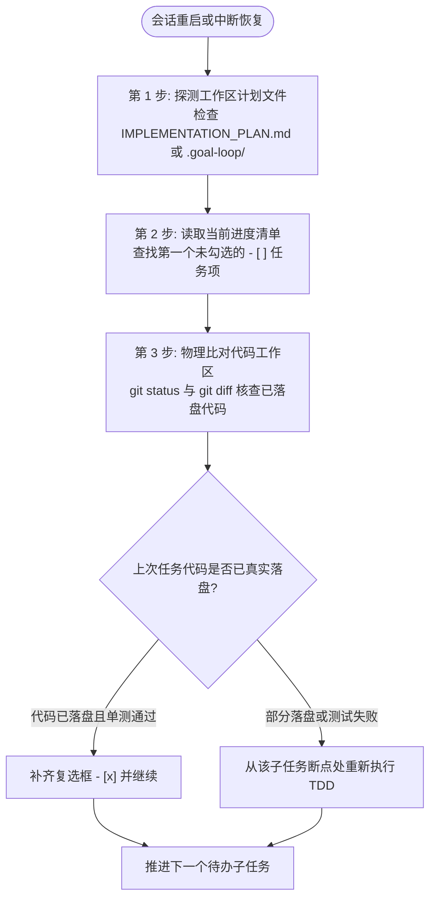

# 上下文工程与持久化规范 (Context Engineering & Persistence Rules)

## 概述 (Overview)

在大语言模型（LLM）执行跨模块、多阶段的长程研发任务中，**上下文腐化（Context Rot）** 是导致智能体智力下降、产生幻觉和过早宣告完成的根本物理原因。
本规范基于 **Manus AI 上下文工程** 与 **Ralph Loop 磁盘记忆理念**，确立一套以文件系统为唯一真相源的上下文管理工程法则。

---

## 1. 持久化优先公理 (Persistence-First Axiom)

```
┌─────────────────────────────────────────────────────────────┐
│ 上下文窗口 (Context Window) = 内存 (易失性, 有限, 极易腐化)   │
│ 文件系统 (Filesystem)       = 磁盘 (持久性, 无限, 唯一真相源) │
└─────────────────────────────────────────────────────────────┘
```

* **核心律条**：智能体的大脑注意力随时可能因上下文截断、压缩、会话重置或服务器重启而归零。**任何未写入磁盘的信息等于不存在**。
* **物理隔离**：所有的关键架构决策、接口契约、技术债排查、环境状态、当前执行步骤与完成标记，必须物理持久化在磁盘文档中（如 `IMPLEMENTATION_PLAN.md` 或 `.goal-loop/state.json`），严禁仅保存在模型 Short-Term 记忆内。

---

## 2. 核心事实即刻沉淀原则 (Heuristic Fact Persistence)

智能体在长任务执行期间，应当建立“记忆外置”的工程习惯：

> **每完成 2 次只读探查（代码阅读 / 文档查阅 / 测试运行 / 搜索）后，必须把提炼出的结论写入工作区 Scratchpad 或计划头部检查点锚点**；捕获到关键架构契约、重大决策、环境边界或致命报错时同样即刻落盘，杜绝信息仅在大脑工作记忆中漂浮。

### 2.1 结构化沉淀指导
- **临时性细节与探索数据**：写入工作区 Scratchpad（`.goal-loop/scratchpad.md`，已被 `.gitignore` 忽略），避免向正式计划文档高频追加微小碎屑导致上下文与计划双向膨胀。"即刻沉淀"的落点是 Scratchpad 或检查点锚点，而非计划正文——正文只按阶段批次同步（见 §6）。
- **核心契约与完成状态**：直接更新任务计划与状态机，保证单一真相源。

---

## 3. 读写决策矩阵 (Read-Write Decision Matrix)

为了在长任务中最大化 Token 利用效率并严格恪守**防御性调用规范 (Read-Modify-Verify)**，智能体在每次决策前必须对照读写矩阵：

| 触发场景 | 读写决策 | 深度架构考量与操作要求 |
|---|:---:|---|
| **完成文件编辑/写入** | 🔍 **防御性验证** | **严格遵循 Read-Modify-Verify 规范**。写入或局部替换后，必须通过 `git diff`、精准查看关键变更行或执行编译/测试状态码检查确认变更准确就位，严禁盲目假设写入成功。 |
| **测试或构建命令结束** | ✍️ **立即写** | 控制台输出和 Exit Code 具有物理瞬时性。必须提炼关键结果（通过/失败断言、核心报错行）持久化到任务文档。 |
| **探索多模态/长文本数据** | ✍️ **立即写** | 查阅图像、PDF 或超长日志后，必须立即转化为精炼 Markdown 文本写盘，因为原始数据即将滑出窗口。 |
| **准备进入下一子任务** | 📖 **读取计划** | 每次开始新子任务前，主动读取计划文档的对应任务小节，清除上个任务的杂乱临时记忆，重置执行目标基线。 |
| **遇到编译或单测报错** | 🔍 **定向读目标** | 仅精准读取报错日志指示的具体文件与行号范围，严禁盲目调用 `list_dir` 全量扫描无涉目录。 |
| **系统中断/会话崩溃重启** | 🔄 **全量恢复读** | 主动读取计划文档（`IMPLEMENTATION_PLAN.md`）或状态文件，依据已勾选的 `- [x]` 秒级恢复执行指针。 |

---

## 4. 跨会话与断点恢复 SOP (Disaster Recovery Protocol)

当遇到意外断开、OAuth 重新登录、会话窗口重置或服务器重启后，智能体必须执行以下恢复序列：



1. **第 1 步**：检查工作区中的计划文件（`IMPLEMENTATION_PLAN.md`）或状态目录；
2. **第 2 步**：自顶向下扫描任务清单，定位第一个未标记完成的任务（`- [ ]`）；
3. **第 3 步**：执行只读命令 `git status -s` 与对应单元测试，排查是否存在“代码已在磁盘落地但状态未更新（Silent Landing）”的现象；
4. **第 4 步**：向用户简明汇报恢复断点（如：“检测到中断前任务 2 已完成落盘并通过测试，正在从任务 3 继续推进”），杜绝重复无用功。

---

## 5. 状态检查点锚点标准 (Active State Checkpointing Standard)

为彻底解决上下文截断导致智能体遗忘当前阶段与进度的问题，所有由 `goal-loop` 维护的计划文件必须在头部保留统一的**持久化检查点锚点 (Checkpoint Anchor)**：

```markdown
## 🚀 活跃执行状态与持久化检查点 (Active Checkpoint)
- **当前执行通道**: [Heavy Track | Fast-Track]
- **当前活跃阶段**: [如：阶段 3: TDD 循环实现]
- **当前活跃子任务**: [如：Task 2.2 - 导出纯函数级联取消实现]
- **最后一次验证状态**: [如：Exit Code 0, 85/85 suites passed (594 tests)]
- **当前子任务重试计数**: [如：0/3；第 2 次触发微观调研，第 3 次熔断]
- **外层循环迭代**: [如：1/5]
- **最新有效提交**: [如：Commit `8f96caf`]
```

* **断点秒级自愈法则**：当智能体被唤醒或检测到上下文被截断时，**首选动作必须是读取计划文件头部的此检查点锚点**，无需遍历全量历史对话即可 100% 重建执行状态机。

---

## 6. 批次同步抗膨胀原则 (Batched Sync & Anti-Inflation)

频繁全量重写大型计划与追踪文档会导致：① 上下文窗口急速膨胀；② 局部替换行号失配；③ 产生大量多余工具调用。
智能体应遵循**微观原子标记，宏观批次同步**原则：
* **子任务级（原子切片）**：仅精准修改计划中对应任务复选框（`- [ ]` ➔ `- [x]`）并更新检查点锚点；
* **阶段级（宏观里程碑）**：仅在当前阶段全部完成、通过测试并提交后，集中一次性更新进度追踪文档（`docs/project/plans/*`）与待办清单，杜绝碎片式频繁修改；
* **临时探查隔离**：临时思路、草稿与中间探索数据严格写入独立临时文件或主计划的 Scratchpad 区域，完工后统一清理。

